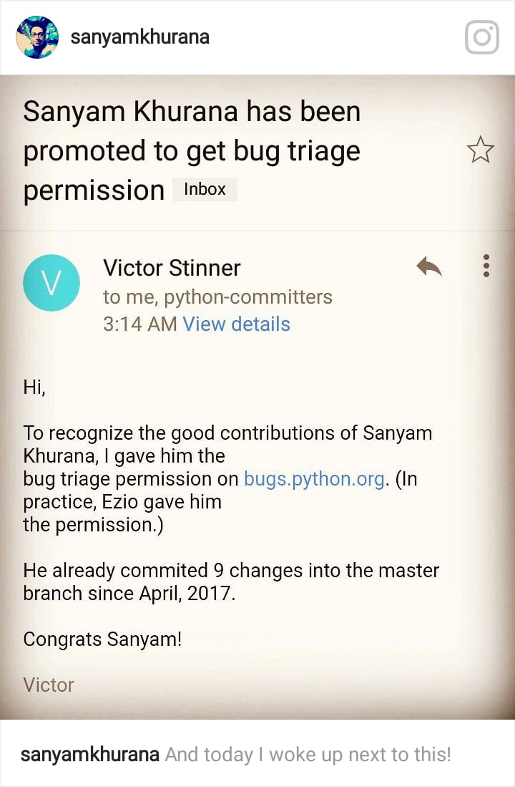

Promoted to bug-triager for CPython
===================================
:date: 2017-12-20 20:34
:author: Sanyam Khurana
:category: FOSS
:slug: cpython-promotion
:tags: foss, python, cpython

This is huge! I couldn't believe when I just woke up next to this mail:

Yes, I got promoted to ``Developer`` role on `bugs.python.org <http://bugs.python.org>`_, which along with other privileges, provides access to close bugs. But with great powers, comes great responsibilities. Closing bugs means that the information is lost forever. So, utmost care is to be taken and reported on why a bug is closed (which might even involve writing code/scripts that prove it :)).

Victor Stinner is mentoring me and a few other folks who have been promoted to learn more about contributing to CPython code base. I've been reading the dev-guide and understanding the entire process to be followed.

Recently we've been also practicing to review Pull Requests along with reporting bugs and contributing code.

I hope to learn more about the process and contribute more to CPython. I wanted to write this post to specially thank `Kushal Das <http://kushaldas.in>`_ and `Nick Coghlan <https://github.com/ncoghlan>`_ who helped me getting started with CPython in Feb 2017 during `PyCon Pune <http://pune.pycon.org>`_ sprints.

Also, thanks to `Victor Stinner <https://github.com/vstinner>`_ and `Ezio Melotti <https://github.com/ezio-melotti>`_ for providing me those privileges.

I hope to get a better understanding of the code base and contribute more ;)
