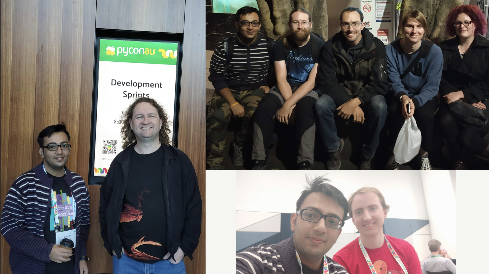

Event Report - DjangoCon AU & PyCon AU
######################################
:date: 2018-9-03 12:27
:author: Sanyam Khurana
:category: FOSS
:slug: djangocon-pycon-au-2018
:tags: pycon, djangocon, python

I was working on a Chinese app for almost 4 months and developing a backend that supports multiple languages. I spent almost daily reading documentation in Chinese and converting it through Google Translate app to integrate third-party APIs. It was painful, yet rewarding in terms of the knowledge that I gained from the Django documentation and several other resources about how to support multiple languages in Django based backends and best practices around it.

While providing multilingual support through Django backend, I realized that every now and then I was hitting a block and then had to read through the documentation and research the web. There were certain caveats that I got around while researching stuff whenever I was stuck and noted them as "gotcha moments" that I decided to cover later in a talk.

I got an opportunity to be at Sydney, Australia for DjangoCon AU and PyCon AU. This was very special, because it was my first International trip, and the first ever time when I was attending a Python conference outside India.

I was excited and anxious at the same time. Excited to meet new people, excited to be at a new place, excited to see how other PyCon takes place and preferably get some good parts about organizing a conference back to India for PyCon India :) I was anxious as it was a solo trip, I was alone with that impostor-syndrome kicking in. "Will I be able to speak?" -- But then I decided that I will share whatever I've learned.

Even before the conference began, I got an opportunity to spend some time with `Markus Holtermann <https://twitter.com/m_holtermann>`_ (Django core-dev). We roamed around Sydney Opera House and met `Ian <https://twitter.com/IanFooteTech>`_, Dom, `Lilly <https://twitter.com/attacus_au>`_ and later went to Dinner.

I'm bad at remembering names! And when I say this, I mean super-bad. But to my astonishment, I was able to remember names for almost everyone whom I had an opportunity to interact with.

I registered as a volunteer for PyConAU which in-turn gave me a lot of perspective on how PyCon AU manages different aspects of logistics, food, video recording, speaker management, volunteer management, etc. There were certain moments when I was like "Oh, we could've done like this in PyCon India! We never thought about this!" and `Jack Skinner <https://twitter.com/developerjack>`_ was really helpful in discussing how they organize different things at PyCon AU.

My talk was on August 24, 2018, and it went pretty well.

You can see the slides of my talk below or by `clicking here <https://speakerdeck.com/curiouslearner/becoming-a-mutltilingual-superhero-in-django>`_

.. raw:: html

    

        <iframe src="//speakerdeck.com/player/f00bdec672534486a2088b644fbe384c" frameborder="0" allowfullscreen style="position: absolute; top: 0; left: 0; width: 100%; height: 100%;"></iframe>
    

Here is the video:

.. raw:: html

    

        <iframe src="//www.youtube.com/embed/go7JklZRtrs" frameborder="0" allowfullscreen style="position: absolute; top: 0; left: 0; width: 100%; height: 100%;"></iframe>
    

During the sprints, I met my CPython mentor `Nick <https://twitter.com/ncoghlan_dev>`_! Nick was the one who helped me in `starting with CPython during PyCon Pune sprints </pycon-pune-2017.html>`_.

I never had an opportunity to try my hands on hardware in my life and seeing so many hardware sprinters, I was curious to start playing with some of the hardware.

During the two days of sprint, I was able to fix my CPython patches, land a few PRs to Hypothesis which is a testing tool and play with `Tomu <//tomu.im>`_ to use it as a 2FA device.

Throughout the sprints, I met many people and yet got so much work done which left me with an astonishment. (I really wish I could be that productive daily :) )

Overall, it was a really pleasant experience and I prepared a list of notes of my PyCon AU takeaways which I shared with PyCon India team.

We had a grand 10th-anniversary celebration and first-time ever we had a Jobs board in PyCon India, along with various other things :)

I want to thank all the organizers, volunteers and attendees of PyCon AU for all the efforts to make the conference so welcoming and inclusive for everyone.

-- Your friend from India :)
