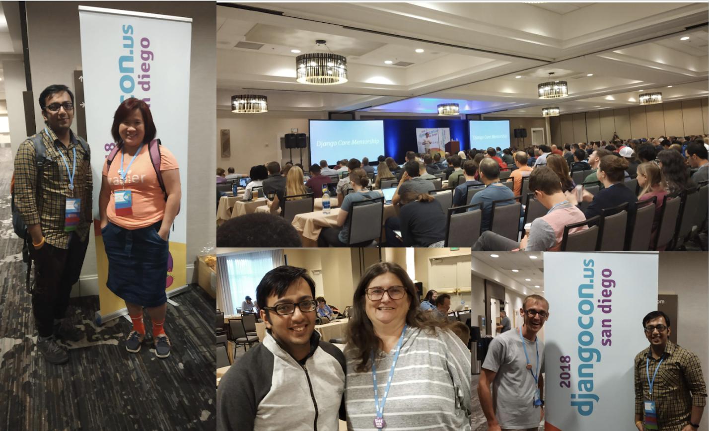
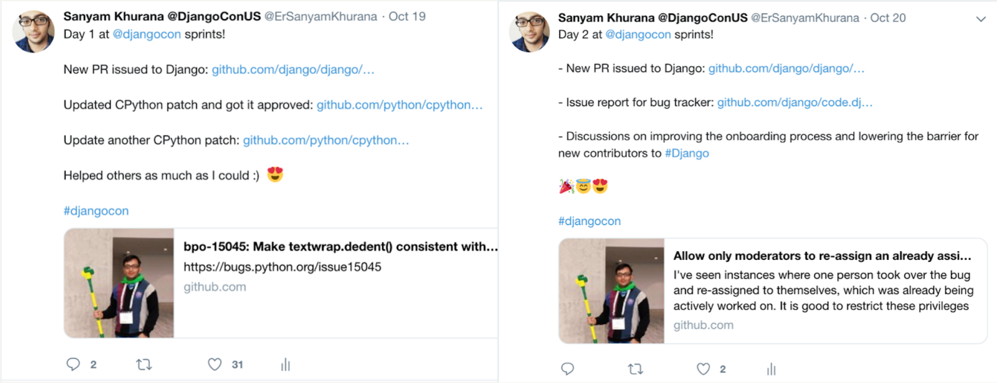
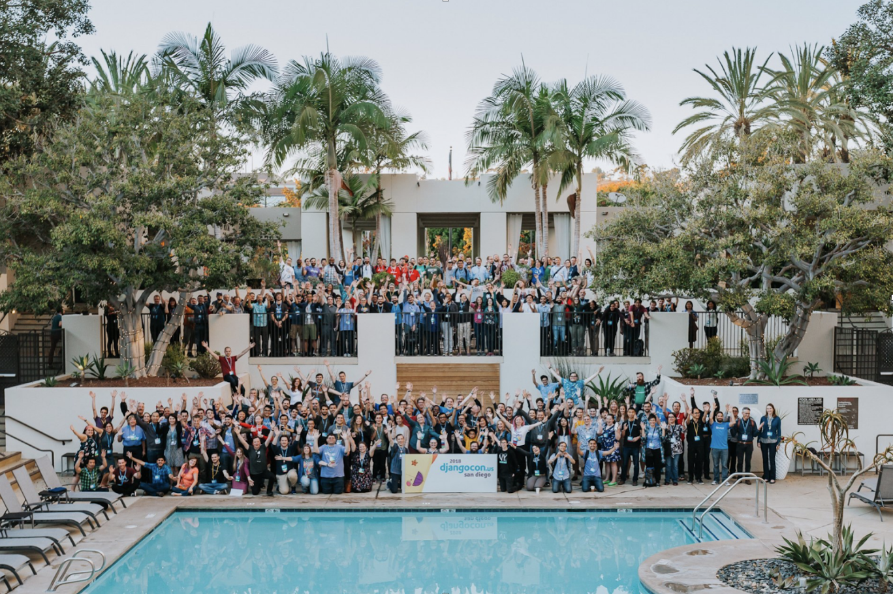

Event Report - DjangoCon US
############################
:date: 2018-10-22 12:27
:author: Sanyam Khurana
:category: FOSS
:slug: djangocon-us-2018
:tags: djangocon, python

If you've already read about my `journey to PyCon AU </djangocon-pycon-au-2018>`_, you're aware that I was working on a Chinese app.  I got one more month to work on the Chinese app after PyCon AU, which meant improving my talk to have more things such as passing the locale info in async tasks, switching language in templates, supporting multiple languages in templates etc.

I presented the second version of the talk at DjangoCon US. The very first people I got to see again, as soon as I entered DjangoCon US venue were `Russell <https://twitter.com/freakboy3742>`_ and `Katie <https://twitter.com/glasnt>`_ from Australia. I was pretty much jet-lagged as my International flight got delayed by 10 hours, but I tried my best to deliver the talk.

Here is the recording of the talk:

.. raw:: html

    

        <iframe src="//www.youtube.com/embed/aiZ_1gsS4F8" frameborder="0" allowfullscreen style="position: absolute; top: 0; left: 0; width: 100%; height: 100%;"></iframe>
    

You can see the slides of my talk below or by `clicking here <//speakerdeck.com/curiouslearner/becoming-a-mutltilingual-superhero-in-django-v2-dot-0>`_:

.. raw:: html

    

        <iframe src="//speakerdeck.com/player/fb85ed99809e4abdb7c15725ba49c139" frameborder="0" allowfullscreen style="position: absolute; top: 0; left: 0; width: 100%; height: 100%;"></iframe>
    

After the conference, we also had a DSF meet and greet, where I met `Frank <https://twitter.com/fwiles>`_, `Rebecca <https://twitter.com/rlconley>`_, `Jeff <https://twitter.com/webology>`_, and a few others. Everyone was so encouraging and we had a pretty good discussion around Django communities. I also met `Carlton Gibson <https://twitter.com/carltongibson>`_, who recently became a DSF Fellow and also gave a `really good talk at DjangoCon on Your web framework needs you! <https://www.youtube.com/watch?v=1BFjg9XtptM>`_.

`Carol <https://twitter.com/WillingCarol>`_, `Jeff <https://twitter.com/webology>`_, and `Carlton <https://twitter.com/carltongibson>`_ encouraged me to start contributing to Django, so I was waiting eagerly for the sprints.

Unfortunately, Carlton wasn't there during the sprints, but `Andrew Pinkham <https://twitter.com/AndrewsForge>`_ was kind enough to help me with setting up the codebase. We were unable to run the test suite successfully and tried to debug that, later we agreed to use django-box for setting things up. I contributed few PRs to Django and was also able to address reviews on my CPython patches.
During the sprints, I also had a discussion with Rebecca and we listed down some points on how we can lower the barrier for new contributions in Django and bring in more contributors.

I also published a report of my two days sprinting on Twitter:

I also met `Andrew Godwin <https://twitter.com/andrewgodwin>`_ & `James Bennett <https://twitter.com/ubernostrum>`_. If you haven't yet seen the `Django in-depth talk by James <https://www.youtube.com/watch?v=tkwZ1jG3XgA>`_ I highly recommend you to watch that. It gave me a lot of understanding on how things are happening under the hood in Django.

It was a great experience altogether being an attendee, speaker, and volunteer at DjangoCon. It was really a very rewarding journey for me.

There are tons of things we can improve in PyCon India, taking inspiration from conferences like DjangoCon US which I hope to help implement in further editions of the conference.

Here is a group picture of everyone at DjangoCon US. Credits to `Bartek <https://twitter.com/bart_pawlik>`_ for the amazing click.

I want to thank all the volunteers, speakers and attendees for an awesome experience and making DjangoCon a lot of fun!
