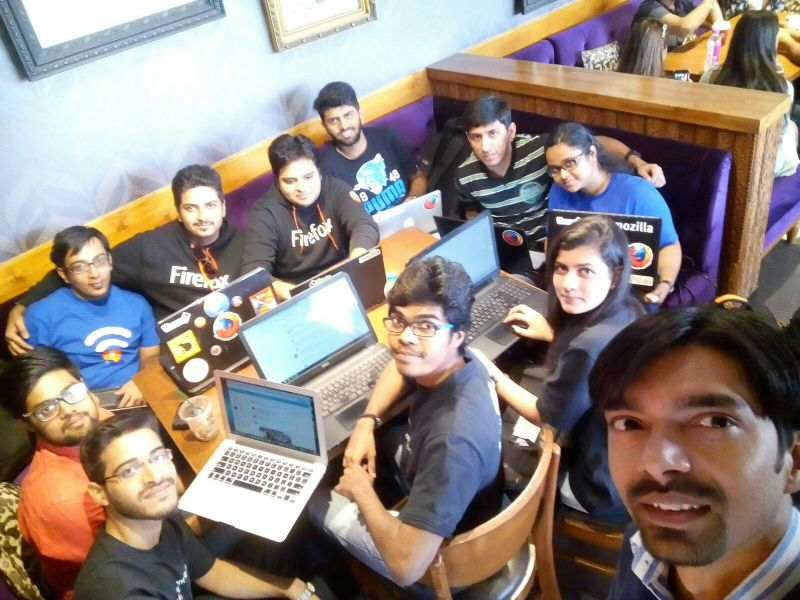
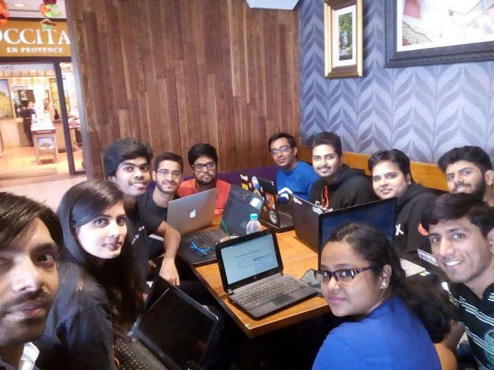

FSA Community Engagement Meet-up
################################
:date: 2015-11-24 20:15
:author: Sanyam Khurana
:category: FOSS
:tags: fsa, Mozilla, mozpacers
:slug: fsa-community-engagement-meet-up

Ah, well, coudn't write about this, as I had my exams and project
submissions. But yeah, here it is. #FSADreamTeam. This would be a quick
post.

On November 14 and 15, we had people for FSA Community Engagement here
in Delhi.

We had Santosh, Kritika and Tanay here in Delhi. Well, I had my exams
and wasn't sure, if I should go, but then I went for both days.

DAY 0
~~~~~

I reached the venue well before time and inquired Santosh about where
we're meeting. I got to the place. We started our discussion about FSA
program.

We discussed about what all is expected through FSA Program and how we
can improve it. Also we started doing SWOT (Strength, Weakness,
Opportunity, Threats) Analysis of FSA Program. Un-fortunately, due to
exams, not enough people joined on Saturday. But as soon as we started
tweeting, people from MozPacers community started collaborating online
despite of exams.

After discussing on Strength and Weakness Analysis, we had our Lunch,
and then we left.

DAY 1
~~~~~

On this day, we had many members joined in for discussion. Ajay, Anup,
Bhuvnesh, Tanshul, Kunal, Pushpita also joined. From the previous day,
we carried on SWOT Analysis. We had a discussion on FSA Program,
opportunities which are expected and also how we can improve on it. Also
we had discussion on collaborating with other communities and strengthen
the Mozilla's mission.

After lunch, we presented our idea of Community Manager App, which
MozPacers are planning to make in order to efficiently manage all the
community statistics. We would first have a pilot run in our local
community and then make it configurable for every community. That would
help in efficiently managing contributions and recognizing contributions
in every local community.

Everyone then said good-bye and we left the venue. I was happy to meet
new people and learn from them.

All our discussions are mentioned here:
https://public.etherpad-mozilla.org/p/delhi
