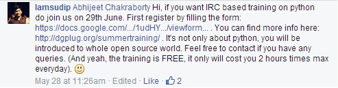

How DGPLUG training is proving beneficial to me?
################################################
:date: 2014-07-14 12:09
:author: Sanyam Khurana
:category: DGPLUG
:tags: dgplug, linux, python, training
:slug: how-dgplug-training-is-proving-beneficial-to-me

Well, at this time, most of you have guessed I'm going to talk about
some sort of training, but what is exactly this "DGPLUG"? What is this
training all about? Well, let me tell you my story.

So, it was when I was ultra-busy in my 4th semester exams, have no time
to update even `The Geeky Way <http://www.TheGeekyWay.com>`__ (a blog I
run to teach others what I know and to learn from others) , was
searching some stuff, saw Facebook News feed for a moment and I think
that was the best thing I've ever done with Facebook. I just came across
a comment on a post by someone regarding learning Python. The person who
commented was "IamSudip" whose comment read as follows:

--------------

**So, what does DGPLUG stands for?**

    DurGaPur Linux User Group.

--------------

Well, my semester exams just started on 27, so already had given one
exam, when I saw this post, I dropped down my books :P and started
browsing more about DGPLUG Training and thought to give it a try.

As soon as my exams finished, I was pretty excited about all the stuff
that would be going to happen. But it was sort of too late after the
last exam. But I didn't loose hope and patience.

Finally, I get through the initial setup to know about IRC (Internet
Relay Chat) and registering a Nick.

So, first time I logged into IRC, didn't get anything what was it all
about. Finally, just search some basic stuff and got to interact with
some people.

--------------

 **June 29, 2014 - When it all started.**

So, I was online before the stipulated time, eagerly waiting for the
training to be started.

Honestly, at first, I thought,

    "Seriously, how would anyone learn just through a sort of text based
    chat?"

I mean there are Google Hangouts, and various other awesome stuff, which
can be used to teach. Anyway, I started following what the mentors
instructed. After just 2 classes, I was pretty much comfortable with IRC
and other stuff they were teaching.

--------------

 **What I learned in this training till now?**

Well, till this point of time, I've learned these these things:

-  IRC etiquette
-  rST (re Structured text)
-  Linux FHS (File Hierarchy Standard)
-  Basic Shell commands

To add to this, a recent class was all about "Blogging". Well I blogged
for several years as of now, so I thought what would be extra I would
get to know about Blogging?

Well, it was a developer specific Blogging. How blogging is really
helpful for a developer, not only to just track his own performance, but
it provides him a log at the end which he can use and others also get
benefited from his posts.

Well, not only this but reading others interact on IRC is always fun and
come to know across many hidden developer stuff in this world. Hidden
because, there was no one to instruct, to guide me, when I first started
with computers.

Even whatever I've learned till today about Programming or Web
Development is just because of my own research on Internet, so
sometimes, I might have missed some important things, which may be of
intermediate or advanced level.

Well, to all those, who really wants to learn something, rather than
mugging up those Engineering Books, and are already frustrated like me
with the Engineering Syllabus (which tends to teach just some theory
without any practicality and real life experience), I would say go for
this course.

One good habit, you'll learn is to READ. Yes, Read as much as possible,
because reading would get you better at stuff, and make you learn more
about the things you're interested in.

When I see back in time, I regret , that I didn't found this training
earlier. Because, I could've been learned quite a lot till now. But I'm
also thankful that I found this training. Just co-incidentally  I've
landed up to something really good.

--------------

Lastly, I thank to these people :

-  Kushal Das
-  Armageddon
-  Sayan
-  rtnpro

and all other mentors and students too who are helping me to learn.
Sorry if I missed some important name, I'm still trying to remember
nicks :)

    ***So, at last, this training is actually which we should call
    Training in true sense!***

Not like the other ones which many of us do just for sake of some
Certificates which are good for nothing. It's not about getting a job in
the end, because if you don't know stuff, you may be placed in a company
but they would surely kick you out after a month or so. It's about
learning. Learning what you're interested in. Period.

 

PS: Thanks all mentors and students, and special thanks to Sudip whose
comment bought me here :)

Regards

**Sanyam Khurana**
**(CuriousLearner)**
