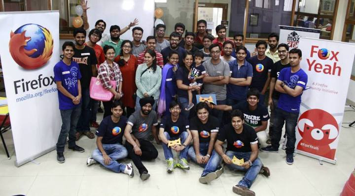

Journey To Being a Mozillian
############################
:date: 2015-07-14 15:27
:author: Sanyam Khurana
:category: FOSS
:tags: FOSS, Mozilla
:slug: journey-to-being-a-mozillian

Few months back, despite of all odds, I attended an event by Mozilla
which was WebMaker event, where I along with my friend Vikram (I
literally had to force him to attend, since the event was far away and
we were tired on that day),  visited to know more about WebMaker Project
and in a hope to start contributing by asking people around. There I met
Anup Kumar Mishra and Ajay Kumar, (both being Mozilla Reps) where they
were telling about WebMaker project.

At the time, I was struggling to get started to contribute to Mozilla
and they told me to drop a mail, and they would help me. I did that
immediately, and also got help from them.

I came to know that they're trying to re-build Mozilla Delhi community
and want some active contributors.

I was interested and keep attending their MozCofee meet one after the
another. Though didn't get enough time to document each event earlier
due to my exams and then my prior commitments. By the way here is our
recent picture :)

But I'll try to summarize all that in this post itself.

Mozilla Delhi started to categorize contributors in two categories, so
as to ease the maintenance of work, as in:

-  Technical Contributors, who are interested in patching bugs and in
   general contributing some Open Source Code
-  Non-Technical Contributors, who promote Mozilla and it's various
   products. They'll manage all the events, arrangements and other
   managerial tasks.

   Though these are not hard-followed in the sense, everyone is free to
   work in both categories, no bounds are there and that is awesome,
   isn't it? (Keep reading, if you want to join as contributor.)

   Next, in order to establish and let people know about Mozilla Delhi,
   we decided to build a website representing Mozilla Delhi. For that,
   we gathered some more contributors as we needed front-end people,
   back-end people, UI/UX designers etc. I reached my developers friends
   and told about awesome opportunity to contribute. Thus I invited
   Nikhil Handa (as he's good in UI/UX), Manraj Singh (back-end and some
   front-end), Akansh Gulati (front-end) and some other people.
   Meanwhile, I was also being actively being pinged on facebook by
   people to know more about Mozilla Delhi and start contributions. I
   was trying my best to guide them further.

   Meanwhile, we were planning things on slack (mozpacers.slack.com) and
   decided to have Dev Sprint v1.0 to decide upon the Website, finalize
   the wire-frame, distribute responsibilities, choosing tech stack for
   the creation of website, et all.

   Dev Sprint v1.0 was planned to be at Zopper (the same company I'm
   doing internship at). Thanks to Co-Founder Surjendu Kuila for
   sponsoring Mozilla Delhi's DevSprint v1.0.

   So, we gathered at Zopper and started discussion on the initial
   wire-frame and using whiteboard, we tried to gathered more
   requirements and listen to what everyone has to say. Different points
   were put forward by the community members regarding design,
   functionality and other non-functional requirements.

   When majority of people agreed upon the design and details, we made a
   separate list of those tasks. Those who had some concerns about the
   design and functionality were explained the approach. After
   brainstorming and lot of discussions we mutually agreed upon a
   design.

   We decided to go with SPA (Single Page Application) as per the
   initial wire-frame, and decided upon technologies to be used for the
   creation of the website.

   All people were not comfortable with any one technology (as
   expected), but then everyone was happy to get an opportunity to learn
   and implement things. With this motive, we finalized the following
   tech stack:

   | Front-End: HTML, CSS, JS, JQuery, BootStrap + (some other front-end framework, if needed.)

   |  Back-End: REST API using Flask (micro web framework for Python), MongoDB for the database.

   | We also finalized using git to be our version control system in this project and made repo on github.

   |  Earlier, we were using a separate account on github, but then I recently got around the concept of Github Organizations, and I suggested that on our slack channel. People liked it, and we shifted from that account to an Organizational account, where we added contributors. You can visit us on Github (`www.Github.com/MozPacers <http://www.Github.com/MozPacers>`__)

   We also decided to use git-flow as it would help us in near future
   for better maintenance and everyone was suggested to make features
   and work on them. Community members mutually agreed on the official
   coding guidelines and structuring of code as per the language they're
   coding in. (For example, for Python PEP8 standards).

   People started picking out different front-end sections and
   implementing them. Most of the front-end is now finished.

   Meanwhile I picked up the back-end and implemented it. Though there
   is much more to be done as in integrations with the front-end and
   security constraints, I think we've learnt a lot along the way.

   Hopefully in DevSprint v2.0 we'll finish the website project and make
   it live.

Are you in Delhi and want to contribute? Then join us at Dev Sprint
v2.0. For more details, please follow the official `Mozilla Delhi
channel on twitter <http://www.twitter.com/mozpacers>`__.
