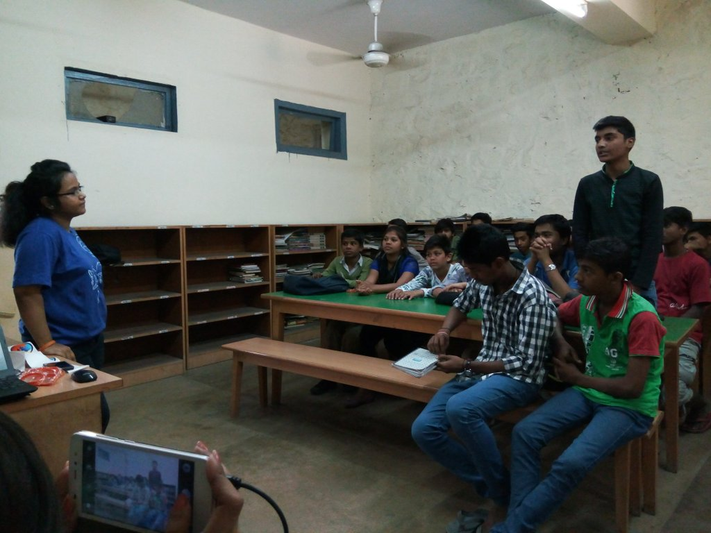
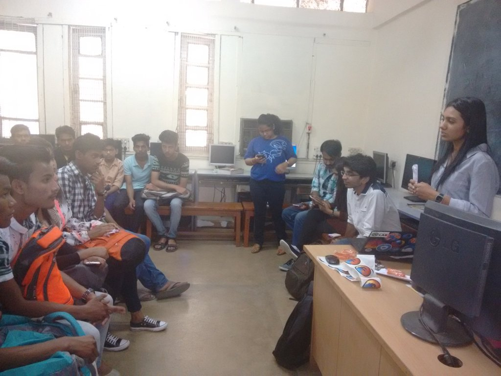
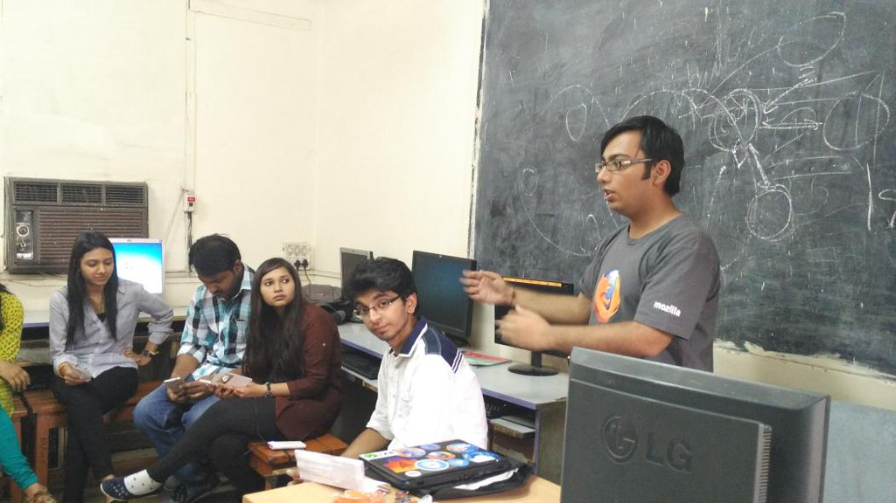
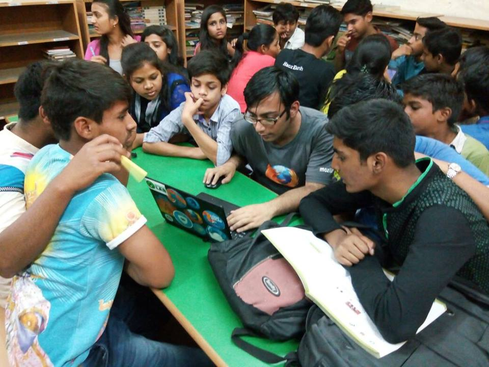
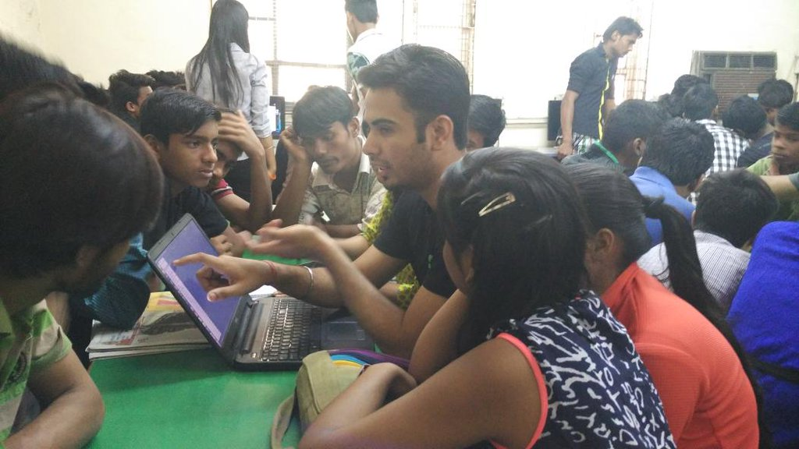
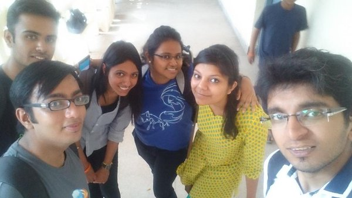

KidZilla by MozPacers
#####################
:date: 2016-04-3 12:13
:author: Sanyam Khurana
:category: FOSS
:slug: kidzilla-by-mozpacers
:tags: FOSS, Mozilla, mozpacers

On April 2, 2016 we had a day full of interactive learning with kids of Bal Sahyog Orphanage, Cannaught Place, Delhi.

I reached at Rajiv Chowk metro at 9:45 AM and found Kona, Saurabh, Kanika, Pushpita and Debarun there.

So, we tried to walk up to the venue and was welcomed by Sandeep who takes care of the Computer Science Department there. We had a bunch of kids waiting enthusiastically to learn new things.

They were from different age groups and classes (from 10 years old to 16 years old). So, first session was by Pushpita discussing about Mozilla.

Second session was by Kanika on basics of Network and introduction to Internet.

I didn't had any session scheduled, but I felt the initial session plan was bit overwhelming for those kids so I suggested Pushpita to use simple terms as much as possible as our main aim was to make students learn. Meanwhile, we were distributing swags to students in between every session.

We wanted to make it fruitful for the kids, so we tried to explain the things in the best possible way we could. I just re-iterated through the sessions by Pushpita and Kanika to ensure that the they're able to grasp what we were telling them.

After this, we divided students into groups and then each mozpacer was mentoring kids on designing a webpage with HTML. Me, Kanika, Saurabh, Chirag and Sonal were teaching 4 groups.

Here is a picture of enthusiastic students who were being taught by Chirag and Sonal.

After this, we had an ice breaking session where we had a quiz about what we told in earlier sessions. We divided students into two teams and there was lot of enthusiasm in the teams. Meanwhile, I was very impressed when I saw some kids playing with software like Photoshop. Some were playing games and yet another kid was just bugging me to learn about Bash.

After this, we had a photo session and then left the venue.

Here is our groupfie :)

I had to hurry to go to PyDelhi Meet. (Next post will be on this!)
