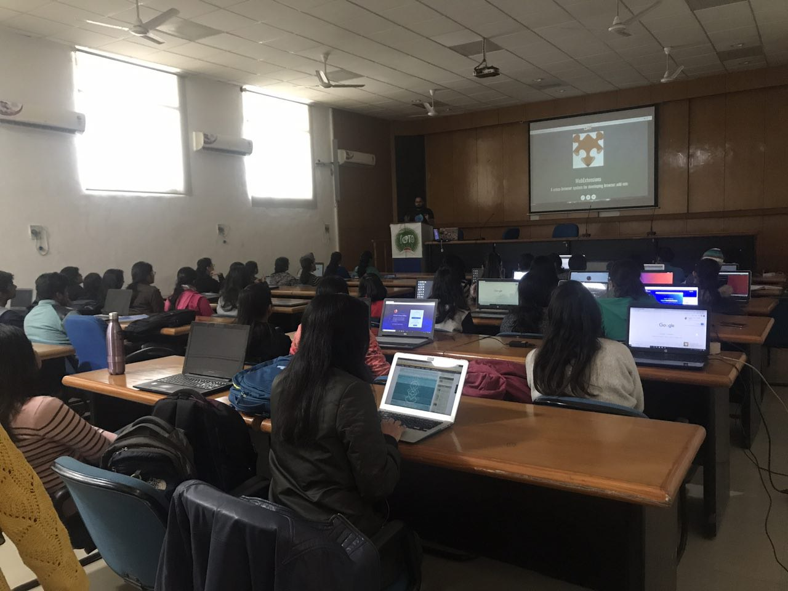
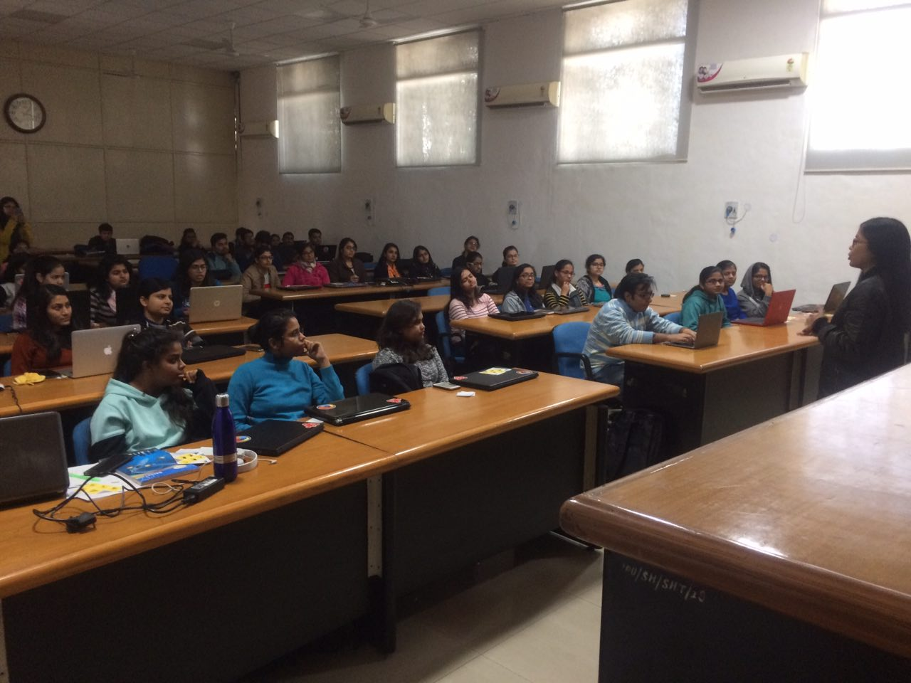
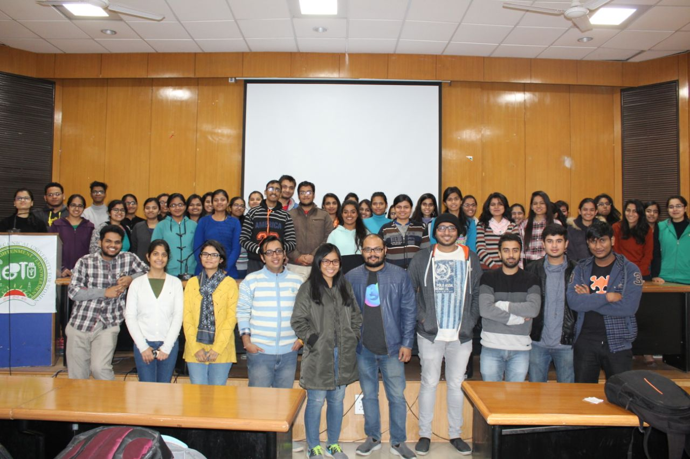

Web Extensions, Womoz & Privacy
###############################
:date: 2018-01-23 20:15
:author: Sanyam Khurana
:category: FOSS
:tags: mozilla, remo
:slug: mozcoffe-2017-end

A Saturday well spent teaching students about Open Source, Add-ons and Privacy.

We had an activity at Indira Gandhi Delhi Technical University for Women (IGDTUW)
for Addons, WoMoz and Privacy.

The session started with Trishul giving a talk on getting started with Add-ons.
He explained about Web Extensions and how they are useful. He also depicted some
of the extensions built by the community. He explained the use of ``manifest``
file and then students started making simple add-ons on their own. The
`borderify <https://developer.mozilla.org/en-US/Add-ons/WebExtensions/Your_first_WebExtension>`_
Web Extension was chosen to teach students. Me, Trishul and Shivam helped them
whenever they were stuck.

The next session was took by Faye on Women in Mozilla and how we can improve the
no of women contributors in the community.

The third session was took by me where I discussed about `What is FOSS` and why
people should contribute to FOSS. We then discussed on various pathways one can
start contributing. We also discussed on finding bugs through BugZilla and Bugsahoy
for Mozilla.

Then Shashikanth discussed about importance of Privacy issues.

We ended the event with a capture of all enthusiastic faces in the meetup:

