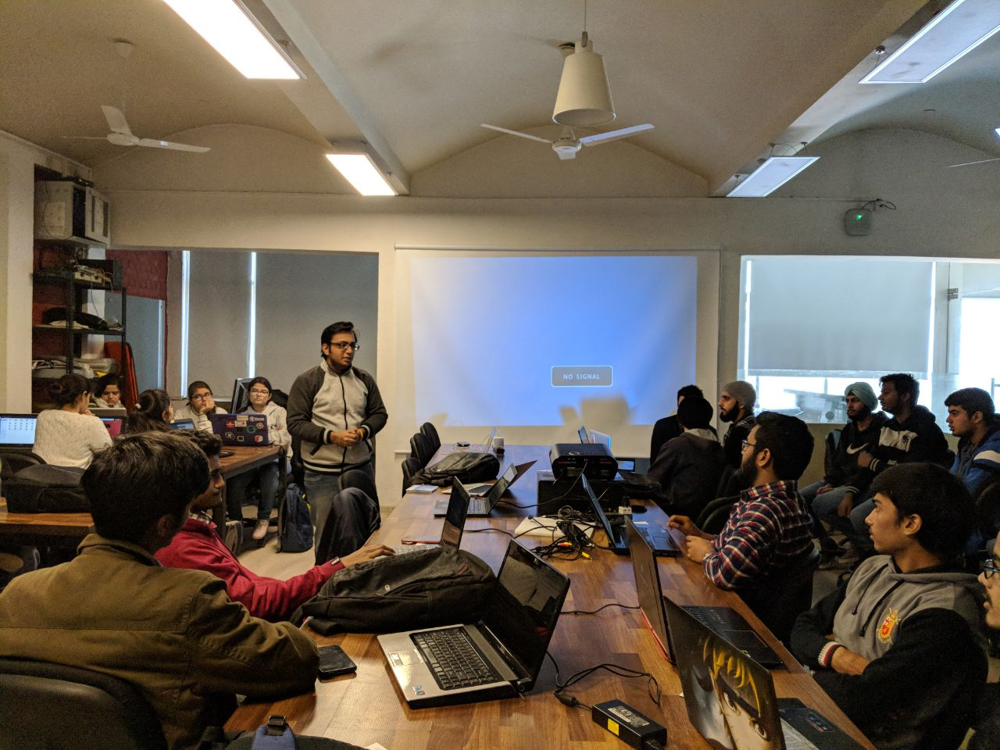
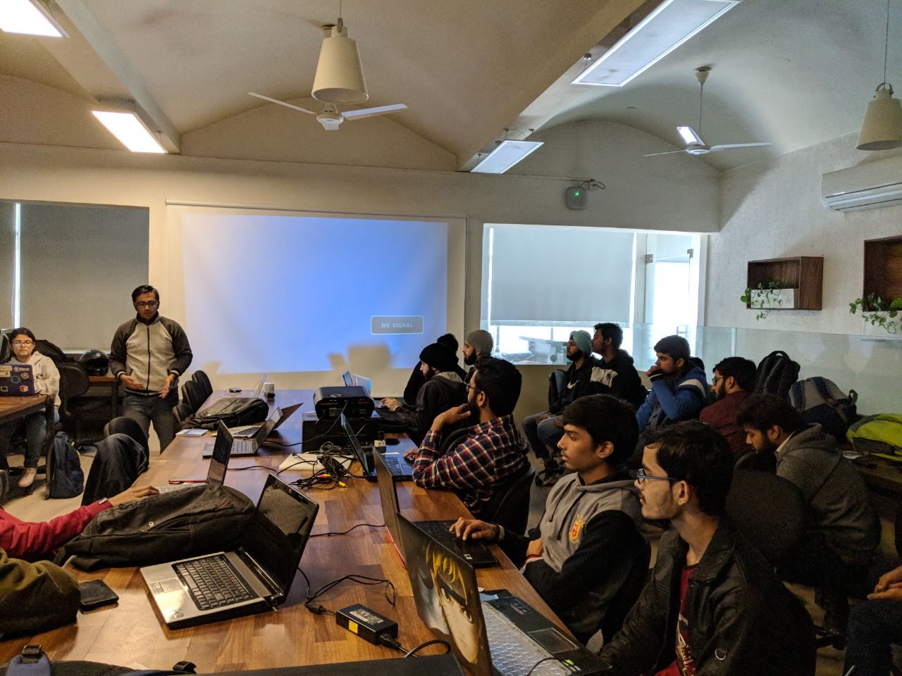
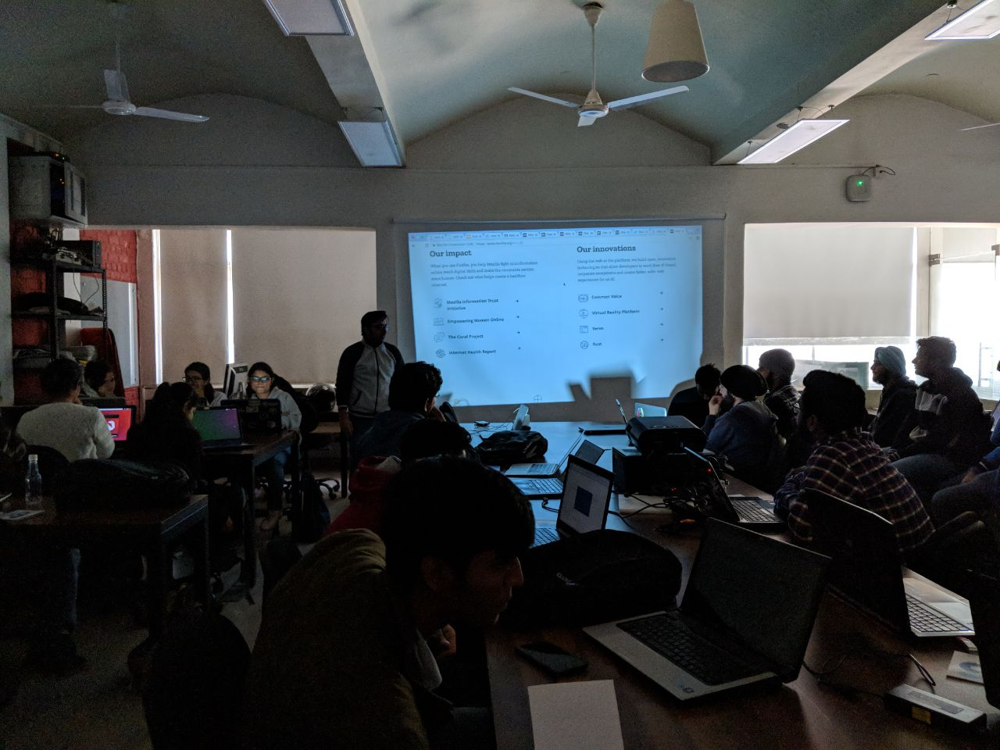
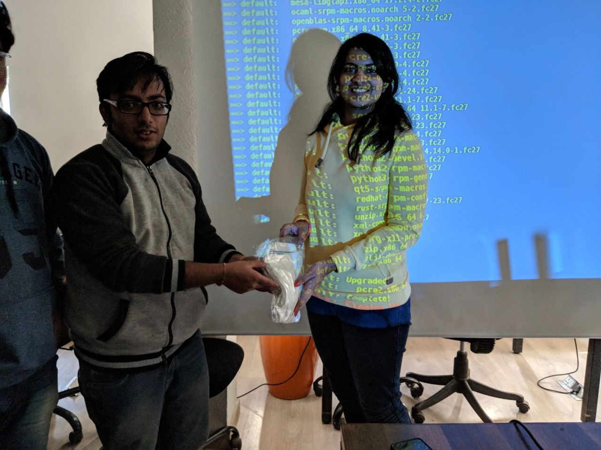

Moz-Fedora Day
##############
:date: 2018-01-14 20:15
:author: Sanyam Khurana
:category: FOSS
:tags: mozilla, remo
:slug: moz-fedora-day

We recently organized Moz-Fedora Day, a one day event on promoting FOSS through
Mozilla & Fedora at Investopad, Hauz Khas, Delhi on Jan 13, 2018. The aim was
to depict the usage of packaging & building one of the Mozilla's project using Fedora.

The core event focused on making the participants automate the build of any of
the Mozilla's open source project of their choice. The aim is to influence
people to switch to Linux as a build environment (We used Fedora for this)
and introduce the basics of the version control system (Mercurial in case of Mozilla).
The event will also introduce to Vagrant for running standardized virtual
machines for build environments.

The session began with Saurabh representing a bit about Fedora and other Linux
Distributions. I discussed about Mozilla, it's mission and different projects.
We then decided to package `Servo <https://servo.org/>`_ in Fedora and guided
folks through the steps to build the system. We used simple Vagrant setup to
package Servo project with Fedora.

At the end of the event, we had a small discussion on how one can find bugs
through Bugzilla & Bugsahoy. The presentation can be found here:
http://www.sanyamkhurana.com/presentations/foss/

We also distributed some swags to folks who were able to make builds successfully.

Most of this was a hands-on session and I saw new faces who were truly excited to
learn about these things. A Saturday well spent, spreading the love of Open Source.
