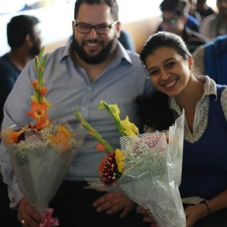
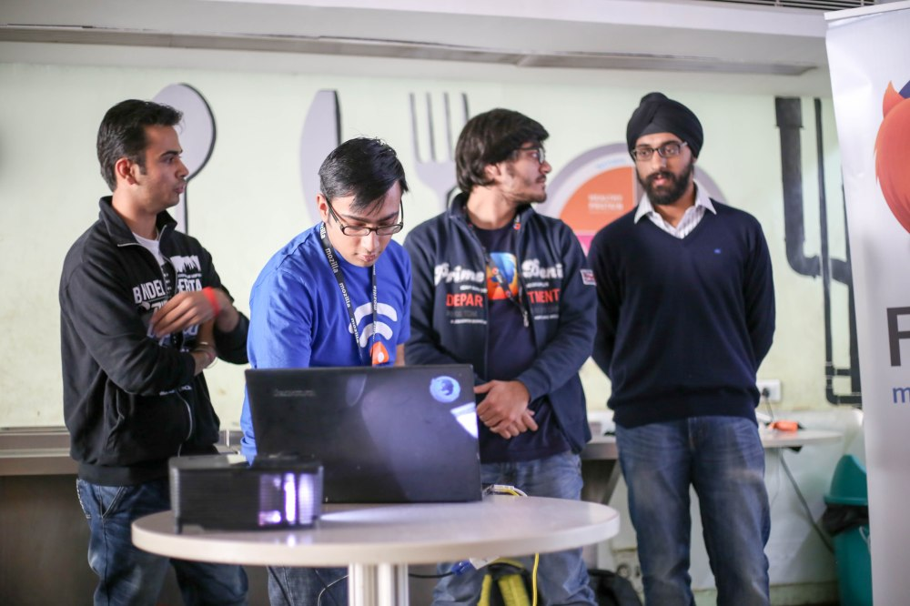
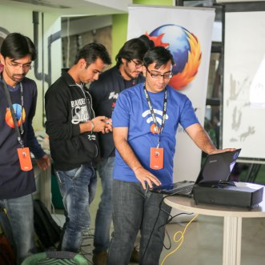
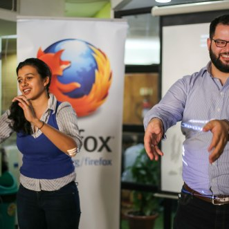
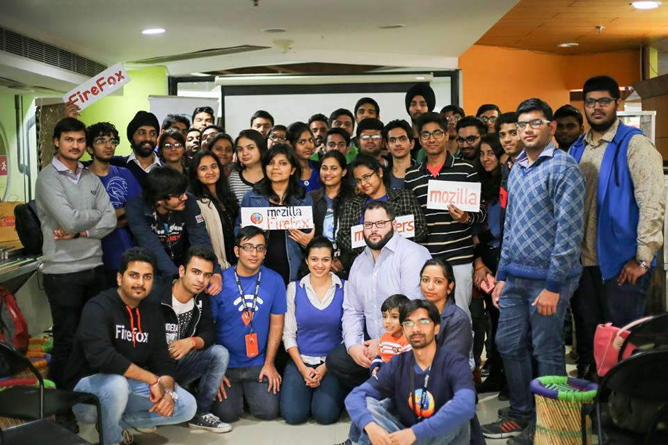
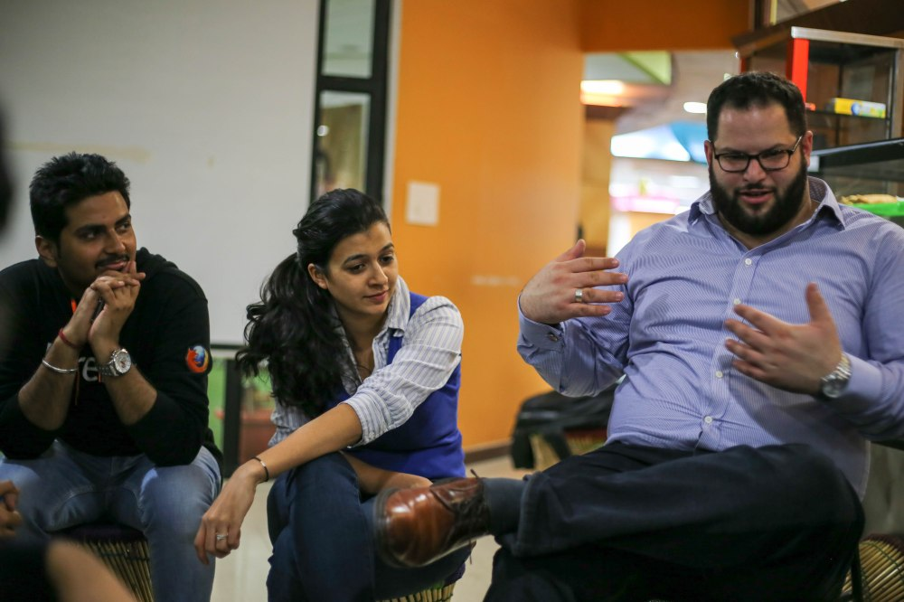

Moz-Coffee v6 with Sara and Jochai
##################################
:date: 2016-02-16 20:15
:author: Sanyam Khurana
:category: FOSS
:tags: fsa, Mozilla, mozpacers
:slug: mozcoffee-v6-with-sara-jochai

Well, this blog post would depict a very wonderful experience! This time, it's not just about MozCoffee v6, it would also depict the preparation phase for it.

Preparation Phase
------------------

So, one fine day, Anup (our community Lead) announces that we would have Mozilla Staff here in Delhi and we've to organize an event in a week. After sometime, Ajay announced that Sara Haghdoosti and  Jochai Ben-Avie would be here and we've just 5 days.

So, we had regular calls about everything, from logistics to how the event would be executed. We had to decide a venue, send invites to people, get their confirmation, plan for waiting list etc. And we had just 5 days. We delegated the work and each core-contributor of the community had shown such an enthusiasm to accomplish each and every task alloted to them.

We decided to make a presentation about our community so that we can release it on event day for everyone along with our website. We decided to have it on reveal JS.
Pushpita and Yash were responsible for making content. Sonal, Kanika and Saurabh were responsible for putting them in the reveal slides.

I would like to mention that none of those mozpacers knew how revealJS works, but I'm happy that they came forward to not only learn it, but implement and execute the task so smoothly. I provided them with the initial set-up of reveal and took an online session where I explained them how reveal JS works & provided them some resources. I was really very happy that they took extra time from regular activities like college to learn reveal and make the slides.

Meanwhile we decided to release our community website in beta on this day. I remember, how me and Nikhil were pushing commits daily, co-ordinating with core-contributors to finish up their tasks.

Meanwhile, Ajay and Bhuvnesh, were looking for a venue, Saurabh made a form for the people and I shooted the mails to people for invites, confirmation and then later RSVP.
Kanika made a poster for spreading the word about the event.

Despite this event being on Tuesday and given that we started to plan the event just 5 days before, we received an enormous response. We're so happy to see so many upcoming people interested in Open Source.

The Event Day
-------------

We had a long waiting list for the event, and finally was the event day. Me and Pushpita reached the venue early and started making arrangements. After sometime, Bhuvnesh, Nikhil, Kanika, Saurabh and Manraj were there.

We again delegated the responses and set-up a registration desk to guide people who were confirmed for the event.

And then, around 3:00 PM, Ajay arrived with Sara and Jochai from Mozilla and they were too excited to meet everyone. After a light refreshment, they moved on to the presentation area.

Ajay started with introduction to Mozilla and it's mission. What is Open Web, need for it, how Mozilla is helping in it. Then he told about the community, various communication channels, how people can contribute to Open Source and contribution pathways.

Next, we had WoMoz session where Pushpita explained about participation of women in Mozilla, importance of women empowerment and encouraged more women to come forward.

After this, our technical team came up on the stage. I explained everyone about the projects we're working on. Manraj told about the Community Manager app.

We released the beta version of our site, invited people to contribute by finding and patching bugs.

After that Sara and Jochai educated attendees about “Internet Privacy” , “advocacy” and also how India is playing major and significant role on “Web Advocacy and Openness”. We had a small exercise as told by Sara where everyone got up and we learnt about Web Advocacy and Internet Privacy.

After this, we had two separate help desks set-up for Technical and Non-Technical respectively. And here we released another project developed in just those 5 days: Moz-Connect (This would be expanded more). We collected details of everyone through `Moz-Connect <https://github.com/mozpacers/moz-connect>`_, later we'll have an automated system set up to invite contributors (if they willingly selected to volunteer for Mozilla in the Moz-Connect) via mail.

Me, Nikhil and Manraj were there on Tech Desk and Kanika, Pushpita were there on the non-tech desks. Met a lot of people who inquired about how to contribute, some people specifically were interested in the tech we're using and asking why we chose them. We tried to answer their queries in the best possible way we could.

Haven't really told anyone till now that how much successful we were in this phase of Moz-Connect. So, I'll tell in this blog post! Once I reached back home and merged the database, then I saw the content filled in MozConnect, many people filled in the queries section that "there queries were already resolved on the help desks" and that made me really happy. (Excellent work there team! ;))

We had a photo session with everyone :)

At around 5PM we had refreshments for everyone. Meanwhile, Sara, Jochai, Ajay and Bhuvnesh were discussing about the community and how we can help even outside the community.

In last few hours, all core-contributors had a talk with Sara and Jochai about problems we're facing, how we started, what are the motivations, what is the future road-map etc.

Then we had another round of photo session and then left the venue.