MozAMU: Mozilla Addons Development at AMU
=========================================
:date: 2018-03-01 17:11
:author: Sanyam Khurana
:category: FOSS
:slug: mozilla-addons-dev-amu
:tags: foss, remo

It all started with PyCon India. I met a few students of Aligarh Muslim University who were trying to teach about FOSS in their college. A few them were already contributing to `Coala <https://github.com/coala/coala>`_. We talked a bit and they were discussing problems they were facing to run that community. I already started a Mozilla community at my college in the earlier days. Since I brought up a lot of folks from my college community in the event, we together discussed *How to nurture FOSS communities in college* as part of PyCon India Open Spaces. Here is a glimpse of the same:

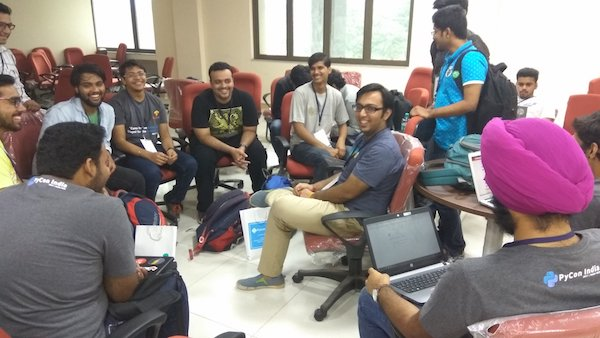

Later, these folks were excited and invited me as a speaker at their college. A lot of planning happened for the event and we were in touch almost daily for different things. We planned the event one and a half month in advance. Finally, on 24th Feb 2018, we decided to have a full-day event around FOSS at Aligarh Muslim University.

We left from Delhi at around 6:30 AM in the morning. We then halted at a cafe known as `Break Point` around Aligarh to have breakfast. We reached the university at around 10:20 AM.

We took some time to test the entire set-up and the event began at around 11:30 AM. I took the first session on **Why you should contribute to Open Source**. We discussed the question that somehow pops up sooner or later into everyone's mind while contributing to Open Source: **What's in it for me?**.

We discussed various pathways one can begin contributing to Open Source Projects like **coding, writing docs, managing team, advocacy, documentation, translation, bug triaging, reviews, organization skills, soft skills** & tons of other things that come as a by-product.

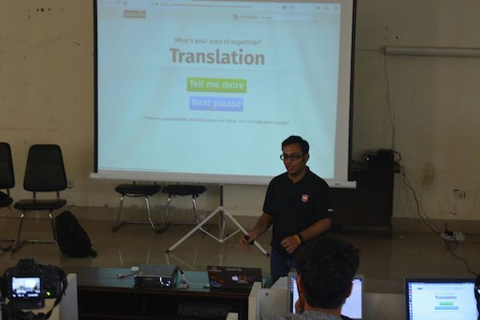

You can find the slides here: `Why you should contribute to Open Source? <http://sanyamkhurana.com/presentations/why-foss>`_.

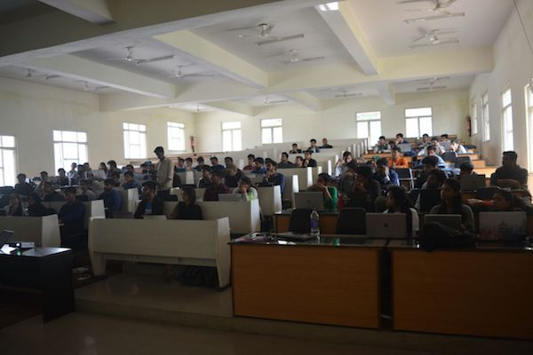

We had a break for sometime and then started with the much awaited **Add-ons session**. Everyone was very excited to start learning to develop add-ons. I began with explaining the initial setup details & discussed JSON briefly to bring everyone on the same page. To make most out of the event, We also organized a few events previously to teach basics of JavaScript & JSON so that students so that they do not feel overwhelmed with the add-ons development.

.. image:: images/moz-addons-amu-3.jpg
    :align: center
    :alt: Curious & enthusiastic attendees learning from Sanyam Khurana (CuriousLearner)

Then Shashank (`@realslimshanky <http://github.com/realslimshanky>`_) took over and discussed ``manifest.json`` and it's importance. Later we developed a simple addon -- borderify, which displays a border on every site the user visits. Some students also modified their scripts to make their add-ons do different things and posted them on twitter. Shashank, me and Shivam Singhal (`@championshuttler <http://github.com/championshuttler>`_) helped everyone with their problems during the development phase.

.. image:: images/moz-addons-amu-4.jpg
    :align: center
    :alt: Curious & enthusiastic attendees learning from Sanyam Khurana (CuriousLearner)

Since all of us are devs, we were able to quickly resolve queries of students. One of the most important things I noticed is that often people misspell either the name of their manifest file or some key in their manifest people resulting their add-on to not load during the debugging phase.

A lot of them then created addons on their own and modified their previously created borderify addon to do more stuff. I've tried to `collect some of them here <https://gist.github.com/CuriousLearner/1a4b08dbf642be8e4dfeb9544c9ab4c9>`_. For a more verbose list you can visit Twitter and search tweets tagging me (`@ErSanyamKhurana <http://twitter.com/ErSanyamKhurana>`_ with `#MozAMU <https://twitter.com/search?q=%23MozAMU>`_.

Imaginations ran wild and one of the attendee created an addon that replaces the word ``Google`` with ``Mozilla`` on every web page. You can see `his hack here <https://github.com/husainhz7/GoogleMozilla/>`_

To make the session more interesting we gave add-ons stickers to anyone who answers the question about what we were just telling them. A lot of folks praised and tweeted about the addons they were generating. We were able to generate **10,000+ impressions with more than 4,000+ accounts reached on Twitter for #MozAMU**.

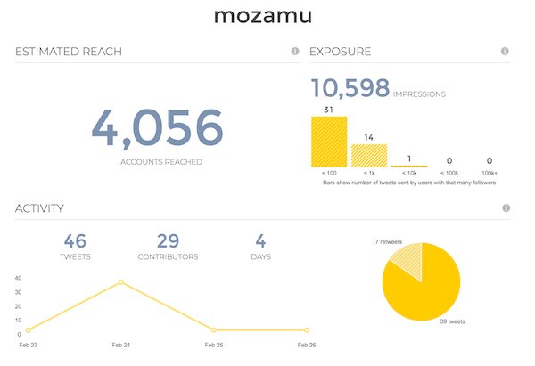

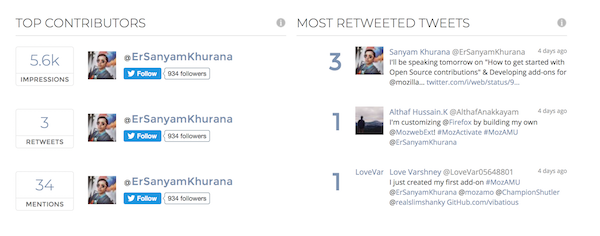

You can `read the full report here <https://tweetreach.com/reports/20714737>`_.

Till this time, I never introduced to anyone about who am I and most importantly not listed any of my contributions in any of the projects. I don't want them to feel overwhelmed and assume that we people have some sort of superpowers that we're able to patch bugs in any FOSS project. I always make it a point to encourage them and help them land their first patch.

And my introduction summed that up in just one line ``I'm one of you -- a part of the community``.

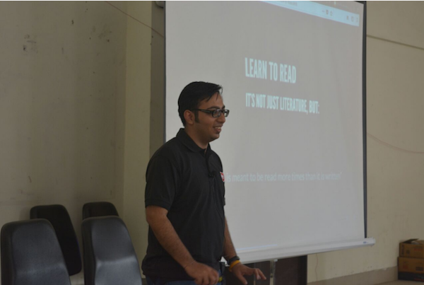

We then hopped on to discuss **How do I start contributing to Open Source?** where we specifically discussed **How to find bugs on different projects through Bugzilla & Bugsahoy**.

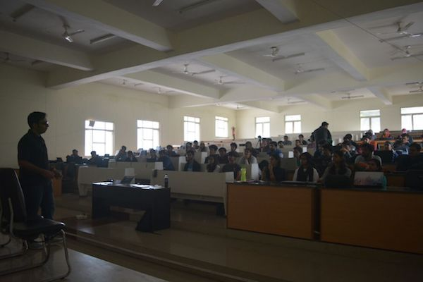

You can find the `slides here <http://www.sanyamkhurana.com/presentations/foss/#/>`_. Then I discussed other Open Source projects I've contributed to like *CPython, Django, Oppia, Mozilla's Devtools, Gecko-Engine & tried to find out similarities in various bug trackers.* We then had a group photo with some of the attendees.

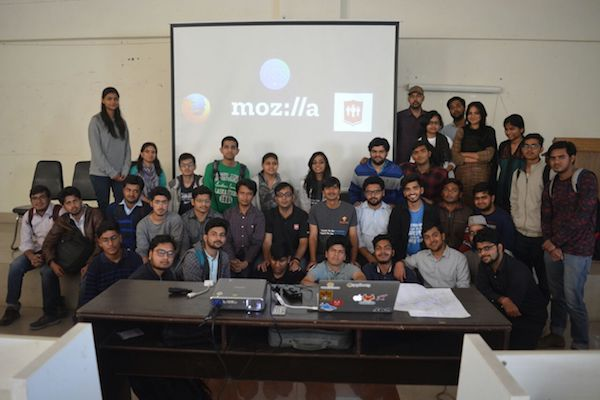

It was already 5 PM and we didn't go for Lunch since students kept us busy with their questions during the lunch break too :P

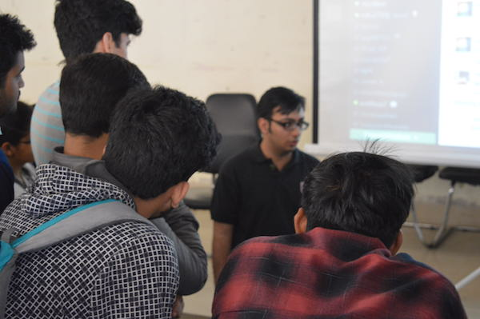

So, we decided to hop-on to a restaurant nearby with the core-team of students that helped in organizing the event with so much enthusiasm.

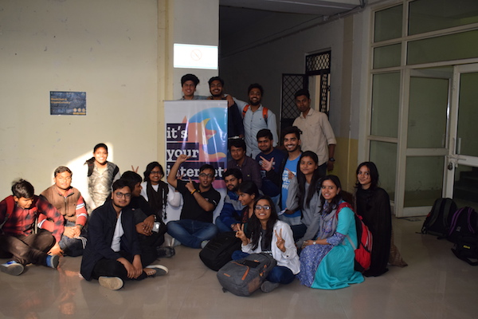

Then we clicked one last photo before leaving Aligarh at around 7:00 PM with the core-volunteers of the event who helped in all the preparations for the event.

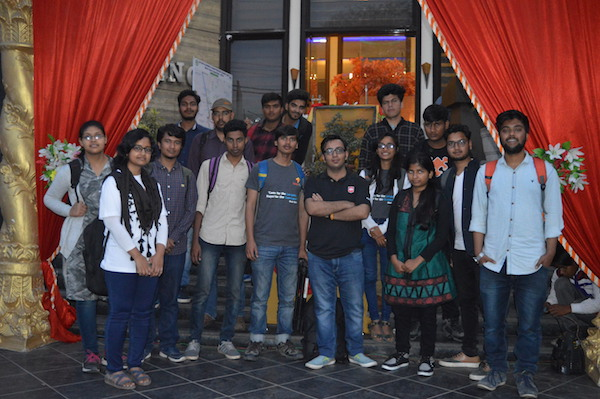

In the end, I would like to congratulate the students for making so wonderful arrangements and pushing up the FOSS community in their college. I hope they will now start landing patches in different FOSS projects & we'll all meet again soon.
