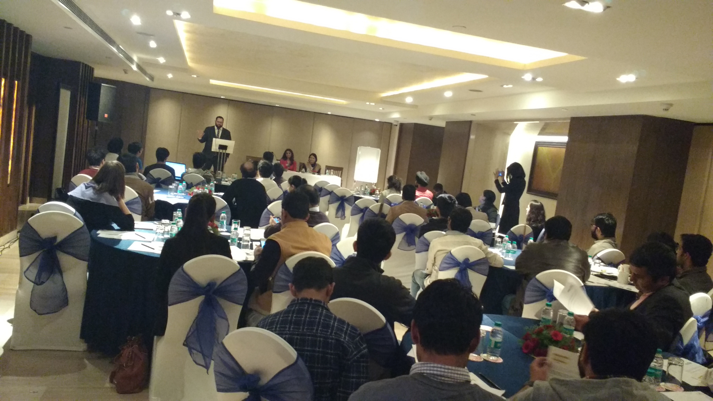
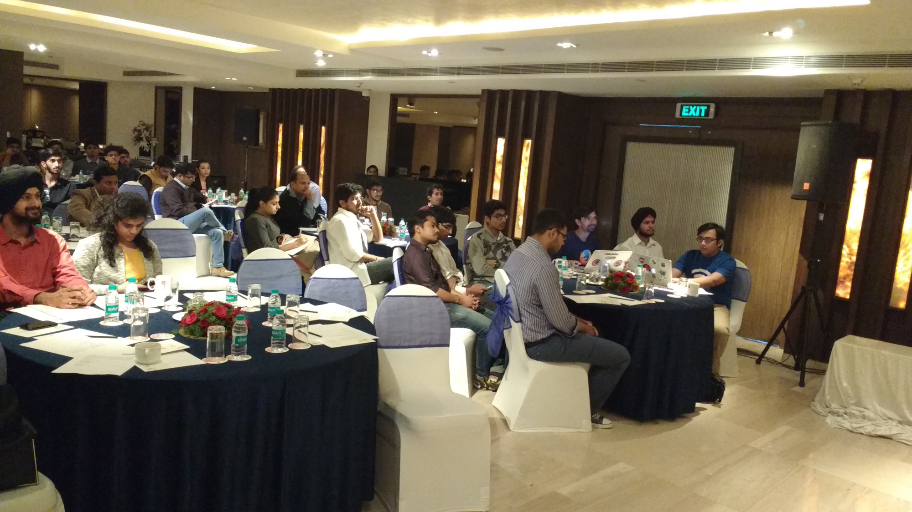
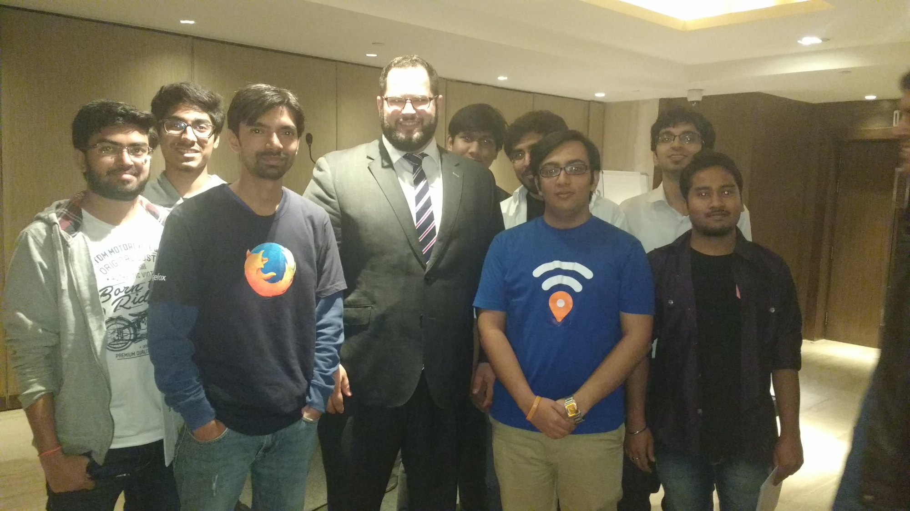

Mozilla's Equal Rating Challenge
################################
:date: 2016-11-26 13:30
:author: Sanyam Khurana
:category: FOSS
:slug: mozilla-equal-rating-challenge
:tags: mozilla, mozilla-rep, remo

The event took place at Hotel Lalit, New Delhi on November 18, 2016. Once again we got a chance to meet Jochai (one of the Mozilla staff) `after around 6 months </mozcoffee-v6-with-sara-jochai.html>`_ and he recognized me :)

The event was powered by SFLC (Software Freedom Law Centre) & Mozilla. Local community volunteers (Mozpacers) helped with the registration.

The event began at 3:00 PM where Jochai introduced people to the problem on making Internet accessible to everyone. After his kick off speech, there was a panel discussion where this issue was discussed. Jochai Ben-Avie, Mishi Choudhary and Smriti Parsheera were speakers. After the panel discussion, people came forward with their questions and got responses from the panel members.

After that we had tea and a great disccussion with Jochai. We also talked with SFLC team to conduct an event where they can explain about different form to Open Source LISENCE to people and how are they different from each other.

We soon plan to have an integrated event with SFLC team where Mozillians would tell about Open Web and community structuring and they will tell about FOSS Laws.

It was a really good experience all together!
