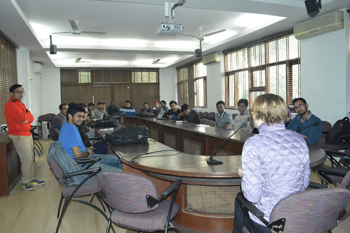
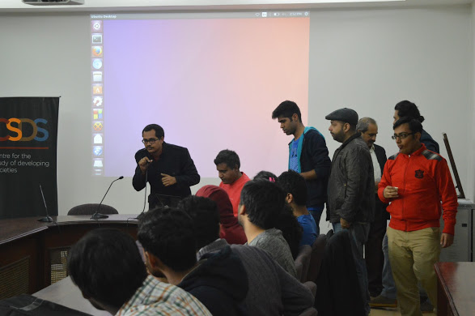
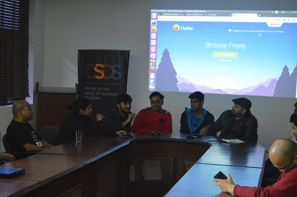
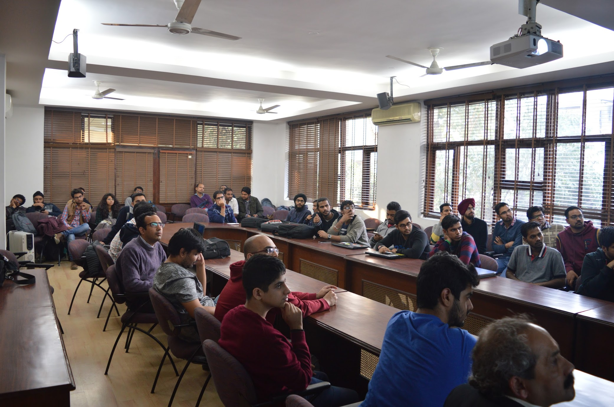

Representing Mozilla in FOSS UnConference
#########################################
:date: 2017-01-09 11:53
:author: Sanyam Khurana
:category: FOSS
:slug: mozilla-foss-unconference
:tags: mozilla, remo, foss

On December 17, 2016; we had FOSS un-conference where all Open Source groups gathered to discuss about the FOSS culture. We had people from PyDelhi, PyData Delhi, Mozilla Delhi (MozPacers), LinuxChix India, Sympy, etc. 

We had three talks scheduled:

Netfilters by Shyam Saini, Networking by Manpreet [:msn] & Deep learning by Shagun

After the talks, we had a panel discussion where there was representative from each community discussing about how each community works; what are the pros and cons in different Open source communities, how can we improve the participation to FOSS.

We also discussed about women participants in different open source communities & also about increasing their participation in every community.

I'm also actively helping in reviving LinuxChix India which focuses on empowering women tech participation in Open source world. Hope to see some good participation there as well.
