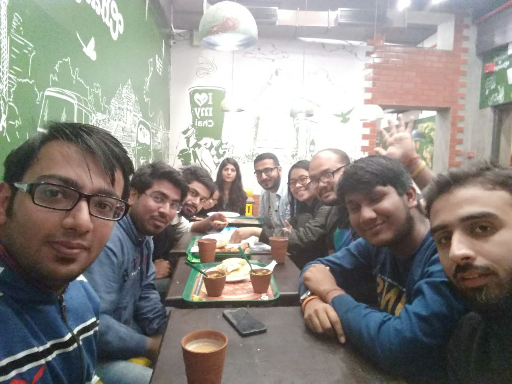

Ending the year with MozCoffee
==============================
:date: 2017-12-24 20:34
:author: Sanyam Khurana
:category: FOSS
:slug: mozcoffee-2017-end
:tags: remo, mozilla

We had ``MozCoffee Delhi`` on last Saturday, Dec 23, 2017. We had a lot of Rep
Attendees this time with other Mozillians. What would have been a better way to
end an year than the MozCoffee. From past various months, the activities in
Mozilla Delhi came to a stand still. But then we had MozCoffee planned in less
than a week. Thanks to my new mentor Trishul for arranging MozCoffee at Chaayos,
Connaught Place, New Delhi on 23rd December, 2017.

We gathered up at the venue in the evening and met a lot of new and old people.
We had Trishul, Faye, Sanyam, Tanzeel, Dvyik, Rajiv, Saurabh, Pushpita, Shivam, Tushar at the meetup.

The discussion started with Trishul explaining about his experience in All Hands Austin.
He told about various projects that have been identified by Mozilla as the major
areas of contributions. We discussed about both tech & non-tech contributions
in various areas.

Near the end of the event, Trishul also helped me in explaining about addons.
Since I've previous experience with JS, it was pretty easy to pick that stuff up.

Finally, we had an amazing photograph which would now become a memory for all of us.

