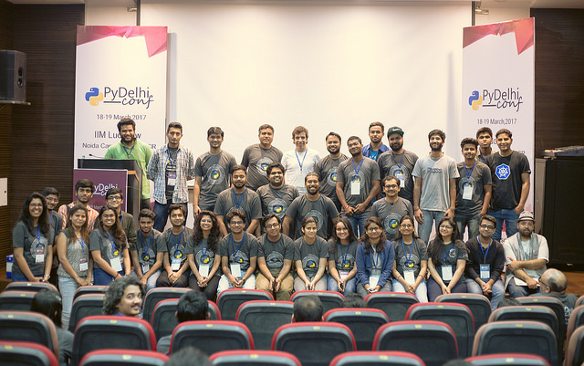

Event Report - PyDelhi Conf 2017 
################################
:date: 2017-04-3 15:50
:author: Sanyam Khurana
:category: FOSS
:slug: pydelhi-conf-2017
:tags: mozilla, foss

This was second year of PyDelhi Conf! It was a two day event organized at IIM-Lucknow, Noida Campus from March 18, 2017 to March 19, 2017.

The two day event covered various talks and workshops along with dev-sprints to help newbies to contribute to various Open Source projects.

I also presented a talk at PyDelhi Conf on *"Building High Performance systems using Django"*. The slides of the talk are available `here <http://SanyamKhurana.com/presentations/django-optimizations>`__.

The major attraction in the event were a lot of panel discussions. One of the discussion was on increasing women participation in Open Source and appreciate the efforts of female contributors in computing.

Another panel discussion was on "OSS communities in Delhi: How we can possibly collaborate together"; where there were many Open Source contributors present from various communities.

Here is a group photo of all volunteers for PyDelhiConf:

You can find all the photos of the event on `Flickr <https://www.flickr.com/photos/theskumar/sets/72157679909955640/>`__.

I'd like to congratulate every volunteer to come forward and help in conducting the conference. We're waiting excitingly to host PyCon India 2017 in Delhi!
