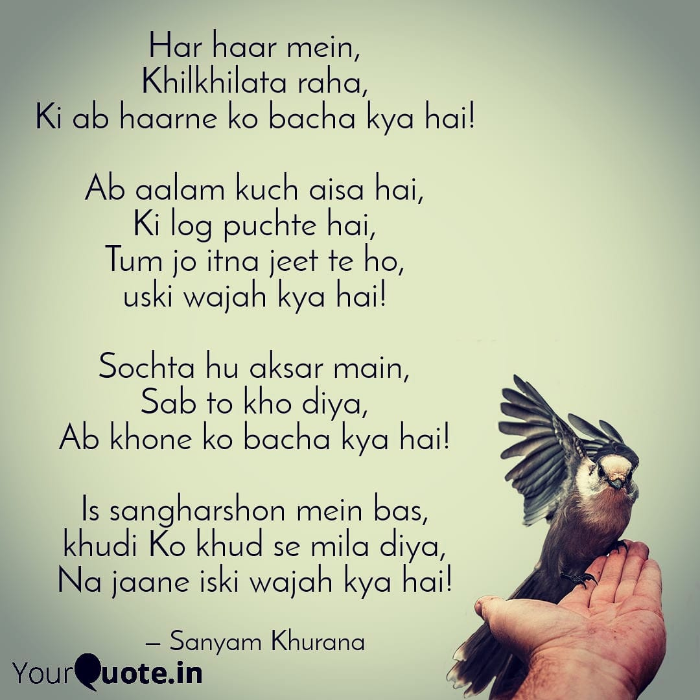
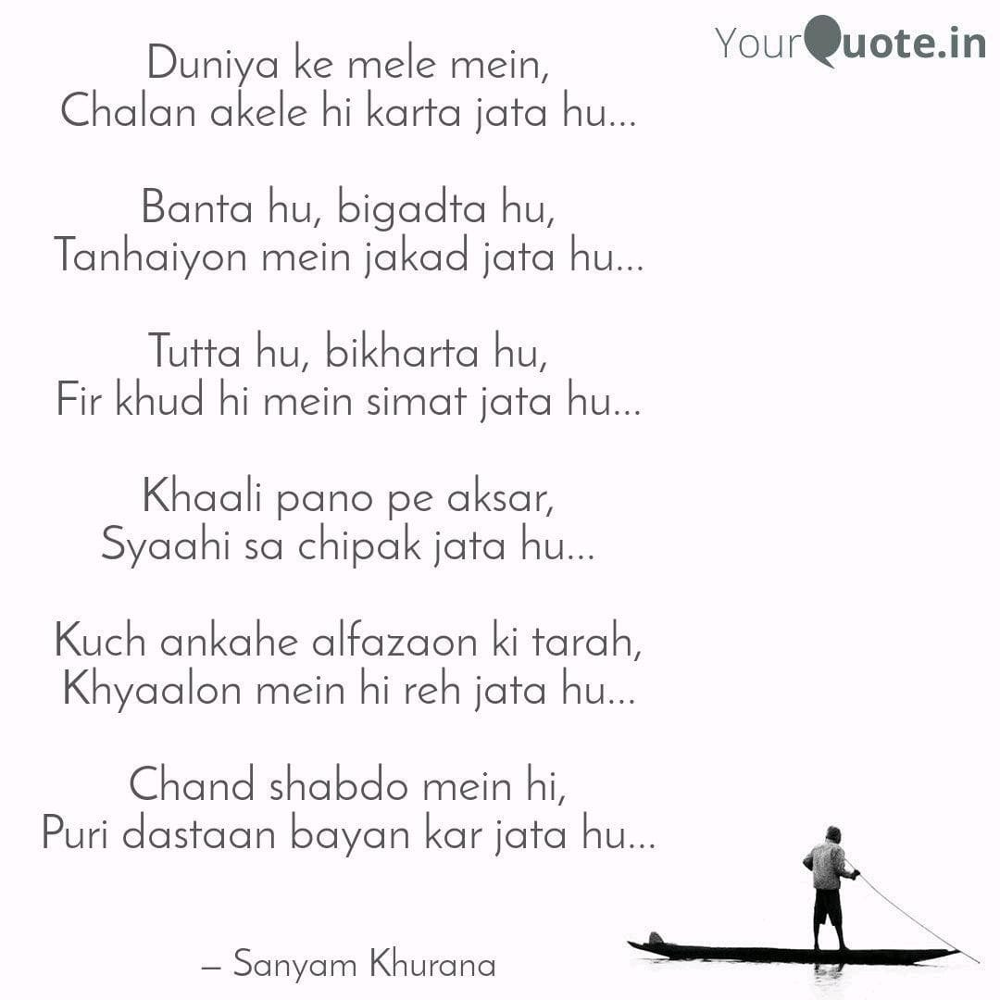
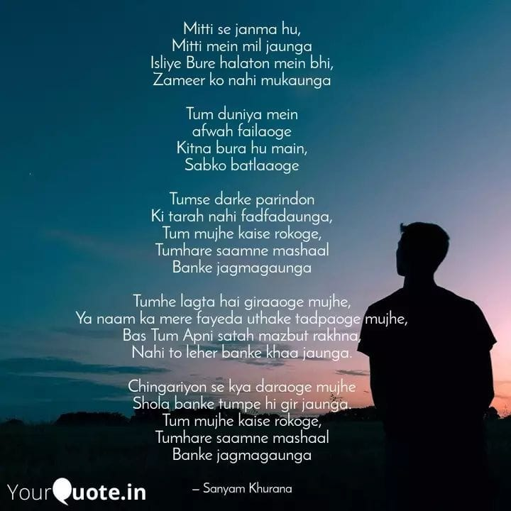

Reflections of a Wandering Soul
###############################
:date: 2025-10-24 16:22:00
:tags: Life, Poems
:summary: A collection of four poems reflecting on resilience, solitude, hope, and authenticity in the face of life's challenges.
:status: published
:lang: en
:author: Sanyam Khurana
:category: Personal
:slug: reflections-of-a-wandering-soul

They say poetry is the language of the soul - raw, unfiltered, and achingly honest. For me, it has been a companion through the darkest nights and the brightest dawns. When words fail in conversation, they find their rhythm in verse. When emotions overflow, they settle into stanzas.

This collection of four poems emerged from different chapters of my life—moments when I questioned everything, when I felt utterly alone, when I refused to be broken, and when I chose to walk my own path despite the noise around me. Some are in Hindi/Urdu, carrying the weight and melody of my mother tongue, while one is in English, reflecting the bilingual nature of my thoughts.

Whether you're navigating your own struggles, searching for meaning, or simply appreciating the art of poetry, I hope these words find a place in your heart. Let's begin this journey together.

----

1. Blooming in Defeat (हर हार में)
=====================================

**Original (Hindi/Urdu)** ::

   हर हार में,
   खिलखिलाता रहा,
   कि अब हारने को बचा क्या है!

   अब आलम कुछ ऐसा है,
   कि लोग पूछते हैं,
   तुम जो इतना जीतते हो,
   उसकी वजह क्या है!

   सोचता हूँ अक्सर मैं,
   सब तो खो दिया,
   अब खोने को बचा क्या है!

   इस संघर्षों में बस,
   ख़ुदी को ख़ुद से मिला दिया,
   न जाने इसकी वजह क्या है!

**English Translation** ::

    In every defeat,
    I kept blooming with laughter,
    for what is left to lose now!

    The situation is such now
    that people ask me,
    what is the reason
    behind your constant victories!

    I often ponder,
    having lost everything,
    what is left to lose now!

    In these struggles,
    I have only reunited
    with myself—
    I wonder what the reason is for that!

**Reflection.**
This poem carries a paradox: when everything is gone, fear of losing fades—and what remains is a clear, fearless reunion with the self.

----

2. In Life's Carnival (दुनिया के मेले में)
===========================================

**Original (Hindi/Urdu)** ::

   दुनिया के मेले में,
   चलन अकेले ही करता जाता हूँ...

   बनता हूँ, बिगड़ता हूँ,
   तन्हाइयों में जकड़ जाता हूँ...

   टूटा हूँ, बिखरता हूँ,
   फिर ख़ुद ही में सिमट जाता हूँ...

   ख़ाली पन्नों पे अक्सर,
   स्याही सा चिपक जाता हूँ...

   कुछ अनकहे अल्फ़ाज़ों की तरह,
   ख़यालों में ही रह जाता हूँ...

   चंद शब्दों में ही,
   पूरी दास्तान बयान कर जाता हूँ...

**English Translation** ::

    In life's carnival
    I walk alone...

    I build myself up, break down,
    and get trapped in solitude...

    I am shattered, scattered,
    then gather myself back together...

    On empty pages often
    I stick like ink...

    Like unspoken words
    I remain only in thoughts...

    In just a few words
    I narrate the whole story...

**Reflection.**
Loneliness here is interior. The poem moves between fragmentation and the quiet craft of gathering oneself back through writing.

----

3. Born of Soil (मिट्टी से जन्मा हूँ)
=============================================

**Original (Hindi/Urdu)** ::

   मिट्टी से जन्मा हूँ,
   मिट्टी में मिल जाऊँगा
   इसलिए बुरे हालातों में भी,
   ज़मीर को नहीं मुकाऊँगा

   तुम दुनिया में
   अफ़वाह फैलाओगे
   कितना बुरा हूँ मैं,
   सबको बतलाओगे

   तुमसे डरके परिंदों
   की तरह नहीं फड़फड़ाऊँगा,
   तुम मुझे कैसे रोकोगे,
   तुम्हारे सामने मशाल
   बनके जगमगाऊँगा

   तुम्हें लगता है गिराओगे मुझे,
   या नाम का मेरे फ़ायदा उठाके तड़पाओगे मुझे,
   बस तुम अपनी सतह मज़बूत रखना,
   नहीं तो लहर बनके खा जाऊँगा।

   चिंगारियों से क्या डराओगे मुझे
   शोला बनके तुम पर ही गिर जाऊँगा,
   तुम मुझे कैसे रोकोगे,
   तुम्हारे सामने मशाल
   बनके जगमगाऊँगा

**English Translation** ::

    Born of soil,
    into soil I shall return—
    thus, even in dire straits,
    I will not bow my conscience.

    You will spread rumors
    in the world,
    telling everyone
    how bad I am.

    Like birds afraid of you,
    I will not flutter away;
    how will you stop me?
    Before you, I will shine
    like a torch.

    You think you can bring me down,
    or torment me by exploiting my name;
    just keep your surface strong,
    or else I will rise like a wave and consume you.

    What will you do by threatening me with sparks?
    I will fall upon you as a blaze;
    how will you stop me?
    Before you, I will shine
    like a torch.

**Reflection.**
A vow of integrity and fearless light. The soil, wave, and flame images echo a natural force that refuses to be broken.

----

4. The Pursuit of Authenticity
==============================

**Original (English)** ::

   Some wants to be famous,
   Some wants to dictate,

   I still look to disappear
   In the world so fake,

   They say that I changed,
   As I took another leap of faith.

   Grinding everyday,
   To open those gate!

**Reflection.**
In a culture of visibility, choosing substance over spectacle is radical. This piece is about stepping away from performance and building quietly, deliberately.

----

Closing Thoughts
================

Poetry, for me, is both mirror and medicine. It reflects who I am in my rawest form and heals what speech cannot reach. These four poems mark seasons of loss, self-discovery, resistance, and authenticity. If they resonated, you're not alone.

This is just a glimpse into my poetic journey. There are many more verses yet to be penned, each carrying its own story and emotion. Poetry is an evolving conversation between the heart and the world.

If these poems spoke to you, I'd love to hear which one and why.
Poetry thrives in the space between writer and reader, where meanings multiply
and emotions echo.

-- Sanyam Khurana
