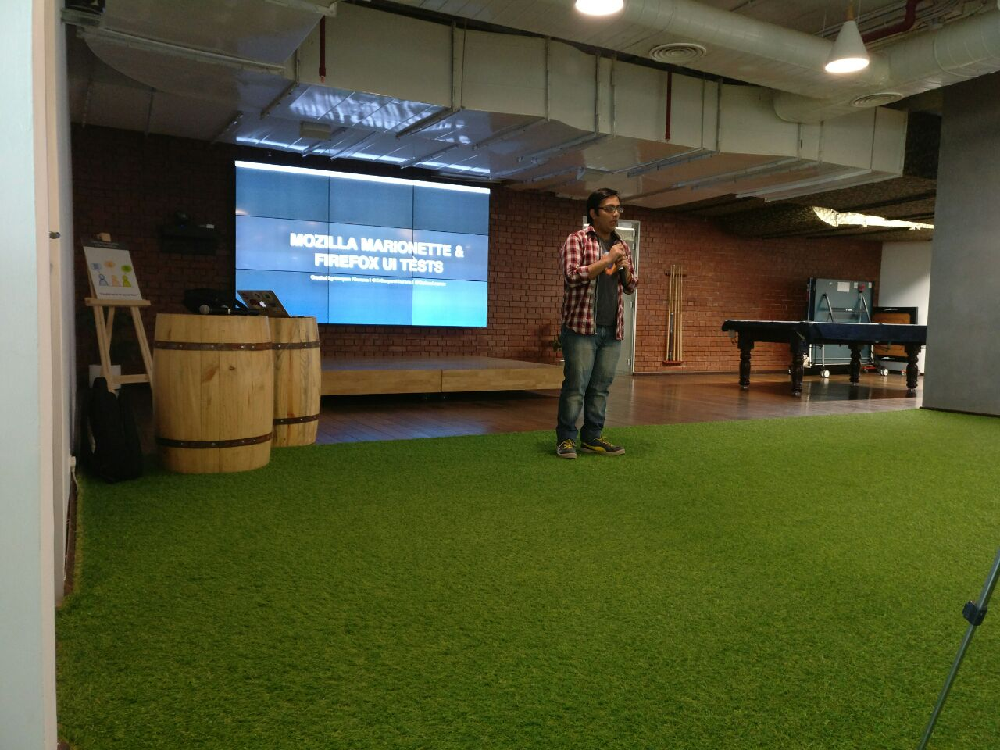
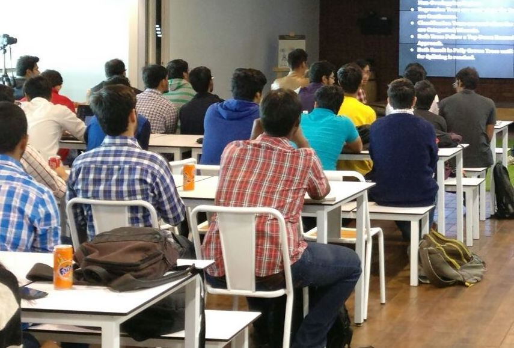
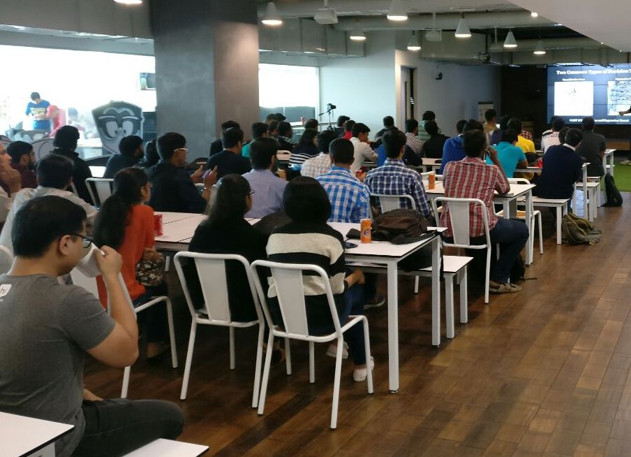
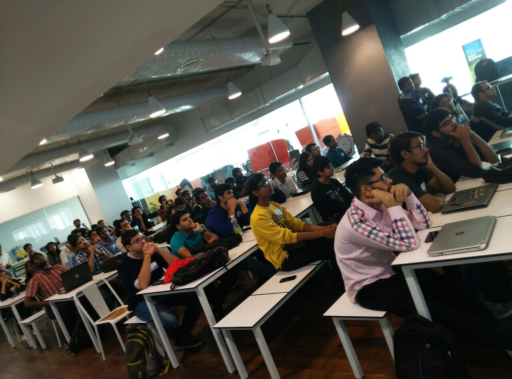

Talk on contributing to Mozilla Marionette
##########################################
:date: 2016-12-05 01:53
:author: Sanyam Khurana
:category: FOSS
:slug: talk-contributing-mozilla-marionette
:tags: mozilla, marionette, python, remo

I've always felt that newbies find it very difficult to get started into any Open Source project. If we talk specifically about code-contribution; which is an essential part of the entire ecosystem, then the no. of people are not enough. I've always found myself surrounded by a bunch of folks who wanted to contribute in Open Source software; and thus asking me questions about how to find bugs, where to get started, etc. One of the most difficult thing they told me is that they don't understand project well enough and thus are not able to recognize on how to get ahead with a particular bug.

I am currently contributing to Mozilla Marionette which is an automation driver for Mozilla's Gecko engine. You can read about my experience on that in blog post `Getting started with Marionette </getting-started-marionette.html>`_ & `Contributing more to Marionette and Firefox UI Tests </contributing-marionette-firefox-ui-tests.html>`_. I recently decided to give a talk explaining people about Marionette.

I delivered a talk at PyDelhi Meetup (one of the Open Source group I'm actively volunteering for :) ). The talk was scheduled for November 27, 2016. My talk was from 3:30 PM - 4:30 PM IST. In the end there was  a QA session where some people came forward to ask questions.

Here are some photos of the event:

One of the most important thing I felt is people hesitate in asking questions. This is because after the QA was officialy over, a lot of people came to me with specific questions and told that they were hesistant during QA session. So for those folks, just remember:

    He who asks a question is a fool for five minutes; he who does not ask a question remains a fool forever. 
    – Chinese Proverb

Other than that, we're all friends :) So, come and clear your doubts! Ask me anything. No one is judging you on the basis of questions you ask. It's more important that you try, rather than the fear of failiure stop you from even taking the first step.

For those who missed the talk, I've tried to process the video and uploaded it on Youtube (That's why this update took so much time).

You can watch the talk on Youtube (https://youtu.be/l1tZaud0GO4)

.. raw:: html
    
    

        <iframe width="600" height="400" src="https://www.youtube.com/embed/l1tZaud0GO4" frameborder="0" allowfullscreen>
        </iframe>
    

Your comments are much appreciated. Tell me if this session helped you, or how further sessions could be improved!

