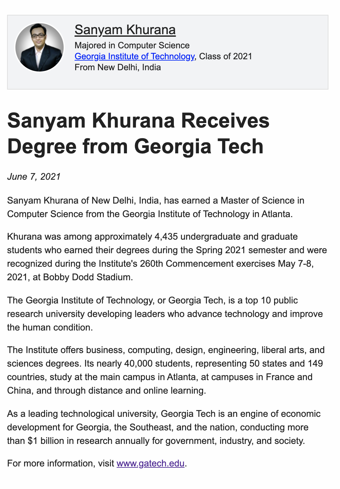

The Grit To Get Out
###################
:date: 2021-09-12 18:48
:author: Sanyam Khurana
:category: personal
:slug: grit-to-get-out
:tags: personal

This is the first post on my blog in a while. I guess this is coming after almost 2 years 9 months. Yes, never wrote those end-of-year review posts too.

A lot has happened.

- I left playing guitar at the end of 2018.
- I didn't work on my book after the end of 2018.
- I went to attend my dream conference PyCon US in 2019 in Cleveland.
- I got accepted into Georgia Tech (one of the top 10 universities in the US for the graduate program).
- I graduated (yet again!). Majored in Computer Science with specialization in Machine Learning \& Interactive Intelligence.
- I learned about UX and Human-Computer Interaction which gave me a pretty wide overview of the world.
- I thrived.

I realized it was comparatively easier to get into a top university than getting out. During my first semester, when I was at Chapter 1, people were at Chapter 6. I realized I was among the Cheetahs, and the only way out is to learn from them.

It was a lot to take in. What I liked about my master's is that it was heavily focused on writing code and understanding concepts.

I wrote code. A lot of it. In a lot of languages, frameworks \& technologies.

Python, Scala, Java, Hadoop, Pandas, Numpy, Javascript, D3 JS, Azure cloud, AWS, SQL, is there to just name a few.

I was interested in Robotics, so I took that course. Learned about drones, writing code for robots, self-driving cars, etc. I wanted to learn about Human-Computer interaction, so I took that course too. My course choices were pretty divergent and the only reason for this is I wanted to explore more things. I collaborated with people, managed teams, and learned how to be on the top of the pop. This wasn't easy.

I also made a few things open-source. One of them was this little cookiecutter template:

https://github.com/CuriousLearner/jdf-latex

This allows people to write according to Professor Joyner's Document format in LaTeX. Yeah, LaTeX! that's another thing I learned in the last years.

When I was accepted, I read a lot of posts about experiences other people had. I'm neither the first to get in nor the first to get out, so experiences helped my journey.

One of the posts highlighted a quote from the movie Martian.

    “At some point, everything’s gonna go south and you’re going to say, this is it. This is how I end. Now, you can either accept that, or you can get to work. That’s all it is. You just begin. You do the math. You solve one problem and you solve the next one and then the next. And if you solve enough problems, you get to come home.”

If you ask me how to get out? That quote tells you all. I learned quite early that this quote reflects reality. Do you want to learn? you'll learn, but you'll be learning with people best in the industry, so it isn't going to be easy, but it can be conquered.

I had this moment when everything went south. Having COVID and battling with one of the most horrifying subjects in GaTech, the Graduate Algorithms. There was just one way out. To do what I can do. I remember laying in my bed, constantly coughing and feeling sleepy because of the medicines, but fortunately, till this point in time, I was already trained by Cheetahs. I couldn't study much in the exam week, constantly coughing while giving the exam. Saw the paper, it was havoc, but there was one way out. Trying to solve the problems as best as I could.

The results came in, and it was all done. I graduated with all A grades. This wasn't easy. It took grit, persistence, perseverance, blood, tears, loneliness, doubts, fear, efforts, but I'm glad I did it.

These courses are very demanding (from anywhere 12 hr/week to 60 hr/week). Some of them like Machine Learning are one of the most demanding courses. I'll write a `review of these courses in some other post <georgia-tech-masters.html>`_.

But yeah, for now, this is it. This is what I've been up to.

Source: https://gatech.meritpages.com/stories/Sanyam-Khurana-Receives-Degree-from-Georgia-Tech/57384805

Finally, #IGotOut!!!

What's next?

You never know! Who knows?
