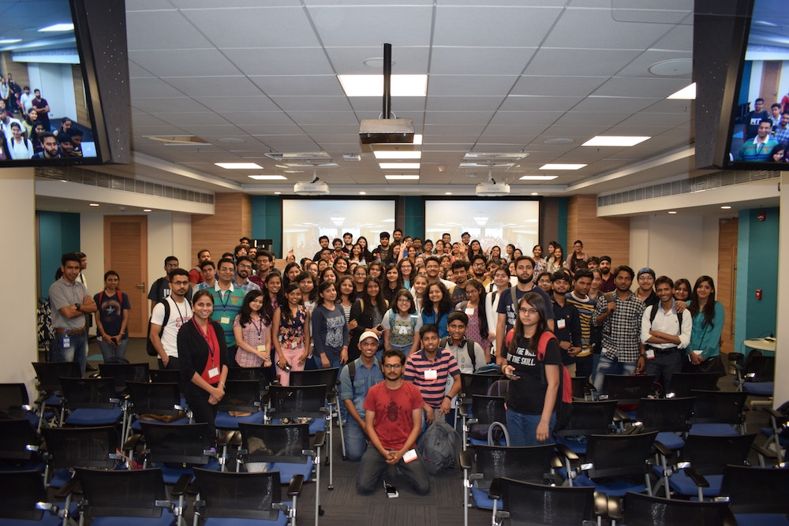
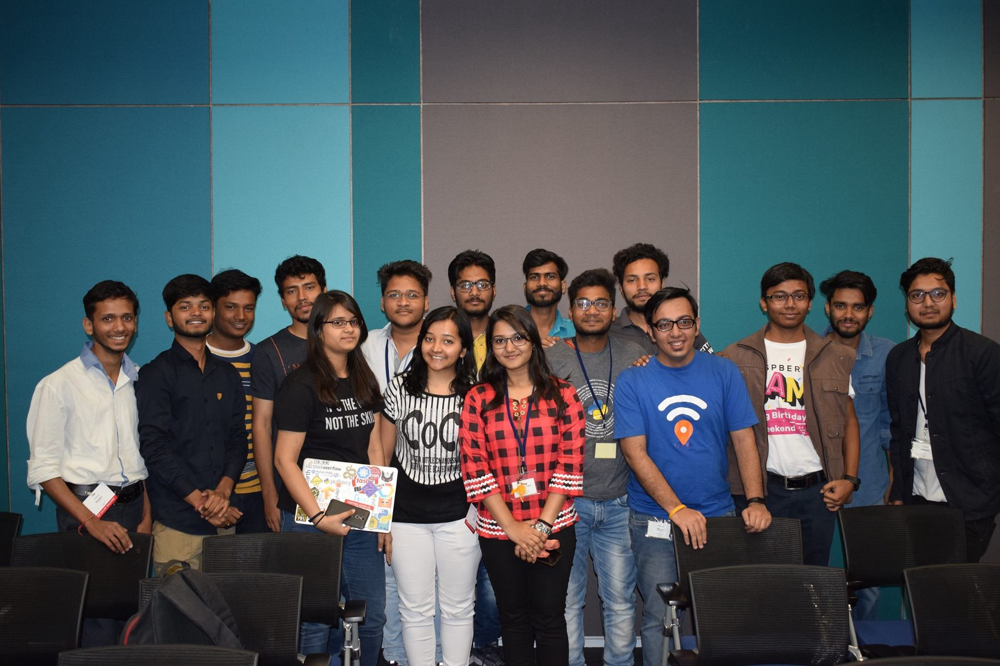
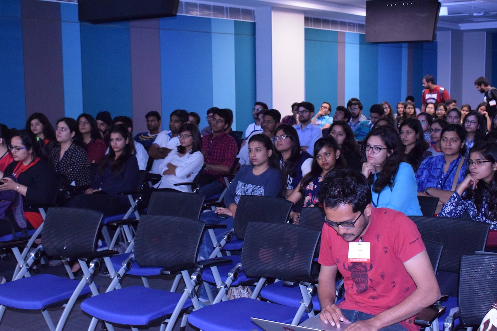
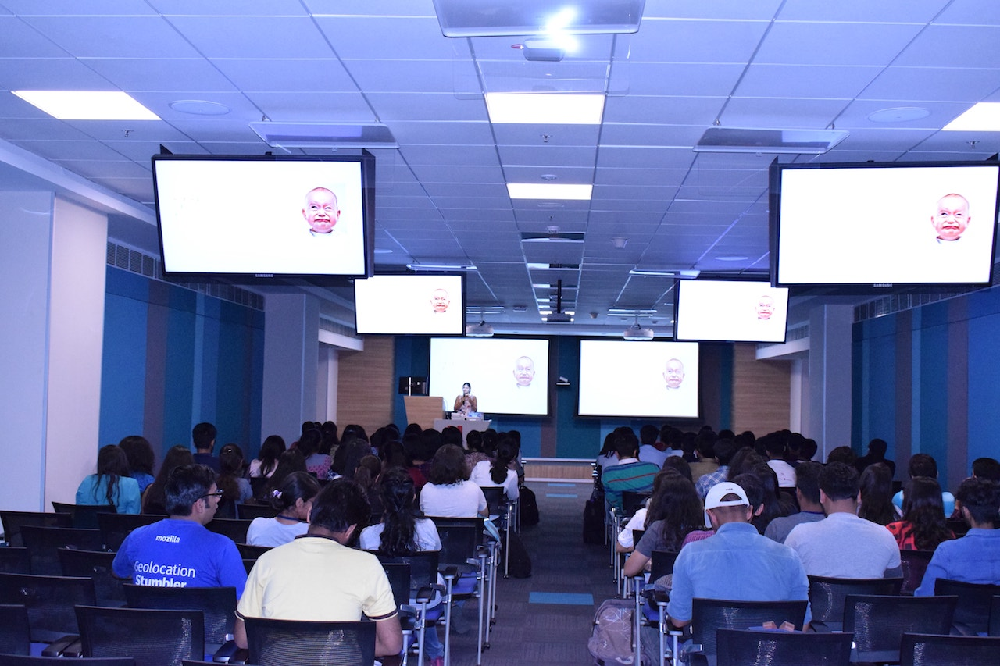
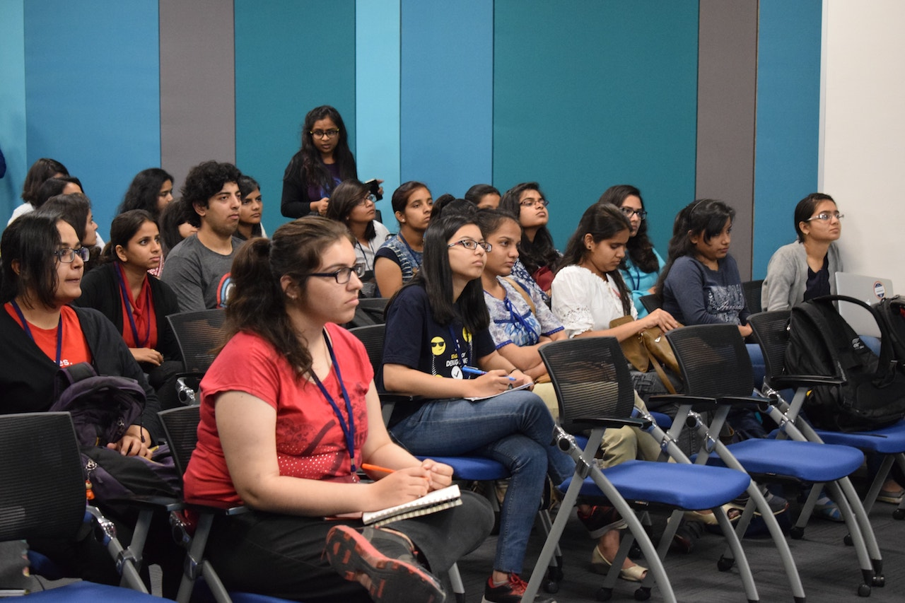

International Women's Day with WoMoz in Delhi
=============================================
:date: 2018-03-15 02:51
:author: Sanyam Khurana
:category: FOSS
:slug: womoz-international-womens-day-delhi
:tags: remo, mozilla, foss

We all know that every year, 8th March is celebrated as International Women's Day. It is a focal point in the movement for women's rights. On this occasion, all the Open Source communities in and around Delhi came forward to hold a mega-meetup to encourage more women to take active part in Open Source & Tech on March 10, 2018.

We were astonished to see the huge turn around of 180 people including 150+ women participants.

Mozilla Delhi, PyDelhi, PyLadies Delhi, LinuxChix India, Women Who Code Delhi, Women Who Go Delhi, Women Techmakers Delhi, and Women in Machine Learning and Data Science were the communities helped up in shaping the event.

Here are some of the volunteers who helped to make the event possible

We had 3 main technical talks which were all presented by Women having a decade of experience working in the technical field. Apart from that, we had several other lightening talks and community talks.

`Kanika <https://twitter.com/a2batic>`_ gave a lightening talk on "WoMoz" & encouraged students to contribute to Mozilla.

Later, `I got a chance to <https://twitter.com/ErSanyamKhurana>`_ give a lightening talk on "Why you should contribute to Open Source", to help & encourage folks to contribute to Open Source projects.

I want to thank everyone who helped with the event & Adobe for sponsoring the venue. Don't forget to join the Open Source groups in & around Delhi that you're interested in. As always, if you need any help on contributing, drop me a mail at Sanyam [at] SanyamKhurana [dot] com.

You can check out more `photos of the event from here <https://drive.google.com/drive/folders/1pIUUpHB-HW1tw4asoLxpZ1c2-fQONpOt>`_
