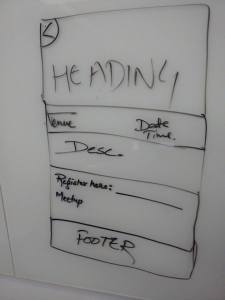

Mozilla Dev Sprint v3.0
#######################
:date: 2015-10-21 16:38
:author: Sanyam Khurana
:category: FOSS
:tags: FOSS, Mozilla, Open Source
:slug: mozilla-dev-sprint-v3-0

Writing after a long time. Have been occupied by a lot of things and
that's why the official site of Mozilla Delhi, mozpacers.org, (Yes, we
got that domain a while ago) was never being ready for release.

The event section integration and stuff was causing a lot of problem.
Nikhil was facing a lot of issues on front-end and there was not good
communication online so that we both can together collaborate physically
and complete it. That's why, we requested for a mini Dev Sprint, and
here it was.

.. image:: images/mozilla-dev-sprint-v3.jpg
    :alt: Nikhil, me and Bhuvnesh
    :align: center

Mozilla Dev Sprint v3.0 held at Cvent, Gurgaon on 18th Oct 2015. We both
reached at 10:30 AM sharp, and met Bhuvnesh. We then got to the
conference room which was where we were supposed to code.

So, we started. As expected, touching our own code after few months left
us buzzard, and one hour was spent figuring out what needed to be done
exactly. After that, Nikhil started to adjust for the overall styling
for Events section and I was modifying the API as requested by Nikhil to
accommodate for the details of a single event to be displayed.

Till 12:30 PM, I was able to figure out the changes to be made in the
API. Then we both were decided about how exactly the page should look
like for a single event. We came up with this wireframe and started
working.

We decided to fill our database with actual values. So, Bhuvnesh started
collecting all the details and making JSON for it. I was reviewing the
PR's already made on the repo and Nikhil was working on the front-end.

Soon, I realized Nikhil's fork was around 50 commits behind the main
repo and now we were ready for merge conflicts.

Around 6:30 PM everything was functional and we were resolving merge
conflicts.

We decided to make this functional site an alpha v0.1 release. Though
most of the things are breaking, but at least the site is functional. :)
We left Cvent at 7:30 PM.

Next day, we had a meeting with core-contributors about general
instructions on PR and commits on github repo and if everyone comes
forward we hope to complete the beta release by next Sunday.
