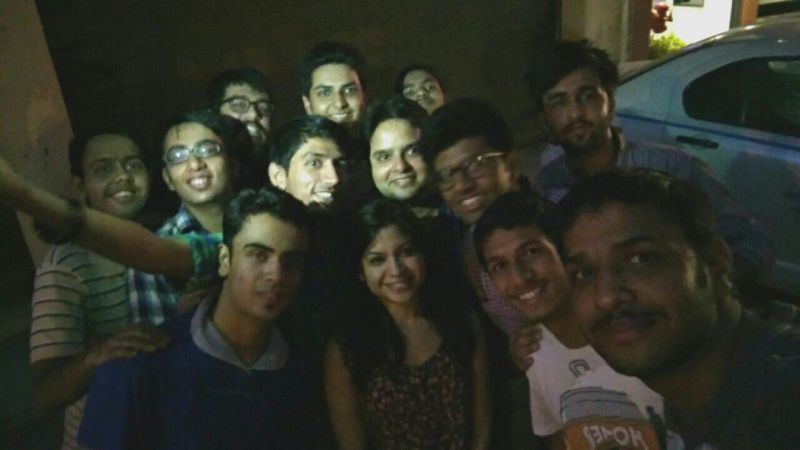
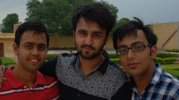

Mozilla Stumbling in Jaipur
###########################
:date: 2015-07-27 00:21
:author: Sanyam Khurana
:category: FOSS
:tags: FOSS, Mozilla, Stumbler
:slug: mozilla-stumbling-in-jaipur

I got to Jaipur Stumbling trip which was majorly sponsored by Mozilla.
Here is a full detail about our journey. Our main motive was to collect
at least 10k reports for the upcoming Mozilla Stumbler Project.

DAY 0
-----

Starting of my journey became complex as some last minute changes caused
trouble for me to reach Kashmere Gate, from where we had to leave
together for Jaipur. After some jiggling I was able to book Uber and
left my house at 3:50 AM. Reached Kashmere Gate at 4:18 AM.

Found the Traveller, met people and we left around 4:35 from there. On
the way picked up Vikram and then headed towards Gurgaon where Bhuvnesh
and others were waiting. Well, and then suddenly our tire got punctured.
Well normal people get dis-heartened, but MozPacers just utilized that
time clicking selfies. One of them is here:

After the tire was changed, we moved on and reached Gurgaon at 6:30 AM,
picked up Bhuvnesh and others and moved on our journey. We played some
music on the go, decided on some movie to watch, but then every other
person could be seen sleeping and no one was watching movie.

After waking up, we continued to play cards and a Game where everyone
had to speak only in Hindi, no English words. We stopped at around 9:00
AM in a nearby Dhaba, and grabbed some tea/coffe and snacks. We moved on
and reached hotel Mansingh at 12:30 PM. Got one hour to freshen up.
Then, we decided not to have lunch and go directly to visit forts since
visitors were allowed only till 5 PM and we didn't have enough time.

We got to Jantar Mantar and got to see many instruments that helped
tracking even the celestial objects. Also got to know that Jaipur was
the first city that was built with a proper plan. We also got to
Nahargarh Fort and enjoyed the awesome view. We also wen to Amer Fort.

At around 6:00 PM all of us were hungry, and stopped by a nearby shop
for some snacks. We also got to look Jal Mahal and Hawa Mahal from
outside. We got back to hotel and people got to their rooms to rest.

Tanshul and I decided to go for swimming. So, we got ready and went for
swimming. Well, I forgot some strokes, seemed like I had some fear of
water returned, but soon enough I was able to overcome that. Tried
different strokes like freestyle, froggy etc. and practiced some basic
stuff. Then we returned to our rooms.

I just got to bed, and then suddenly someone entered the room. It was
Nikhil, telling that we have a meeting at the conference room and I've
to hurry. I got to the place, and we had some discussion on the website
project and also about involving new contributors. Since we had many new
people with us, we told them what was going on in the community and
status of various things we are planning. We then had dinner and decided
to carry on the discussion about the website project in the room.

At 11:30 PM, we gathered in a common room, on a single bed and had that
discussion. After that, Anoop & Ajay started telling stories of Ghost.
Not to forget that this left some people in so much fear that they slept
with keeping lights of their room on. :P

DAY 1
-----

Around 12:30 AM I got bored and left to sleep since it was more than
full day I got to sleep. Later, Vikram came and then around 1 AM I got
to sleep.

Around 4:30 AM I got up, and took a bath. At around 5:30 AM I was ready,
got off the room and roamed in the lobby area for some time. No one was
there :( At around 7:00 AM I got inside room, Vikram was sleeping so I
though to roam outside only, I got outside but this time forgot to take
the keys :P

I returned at around 7:30 AM and then rang the bell, Vikram got up to
open the door and then got ready. We got out for breakfast and then
decided to meet at 10:00 AM.

We then shooted community videos on Stumbling experience. Clicked some
pictures in and around hotel and then left to visit City Palace.

Well, we got a guide (We called him MozGuide) there who helped us
explored the place and we got to see various places where different
movies like Jodha Akbar was shot.Here is a picture of MozPacers with
MozGuide.

 .. image:: images/mozilla-stumbling-jaipur_2.jpg
    :alt: Jaipur stumbling
    :align: center

We left Jaipur at around 2:30 PM. The journey continued and suddenly
something happened.

I was on the last seat as usual and looked back and realized that Diesel
was leaking. We immediately stopped and got that the grip of tyre weared
off. Now this caused us a major problem. We went back and forth to
various shops on highway in search of a tyre, and then ultimately at
around 6:30 PM we got to some good shop. After that we got to the
traveller and continued to Delhi.

We reached Gurgaon at around 11:30 PM. Meanwhile we were playing
different games like Truth & Dare. Me and Vikram got off near AIIMS and
then returned to our homes. I reached around 1:00 AM

In between the journey we named everything pre-pending it with Moz like
MozWater, MozChor, MozGuide, MozJail, MozFort et all. :)

Oh, well, did I forget to mention that I just got declared as the winner
of Mozilla Stumbler v1.0 Delhi NCR? :)

Here is a picture while we were in Jaipur:

