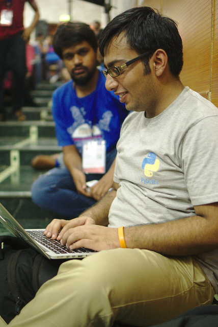
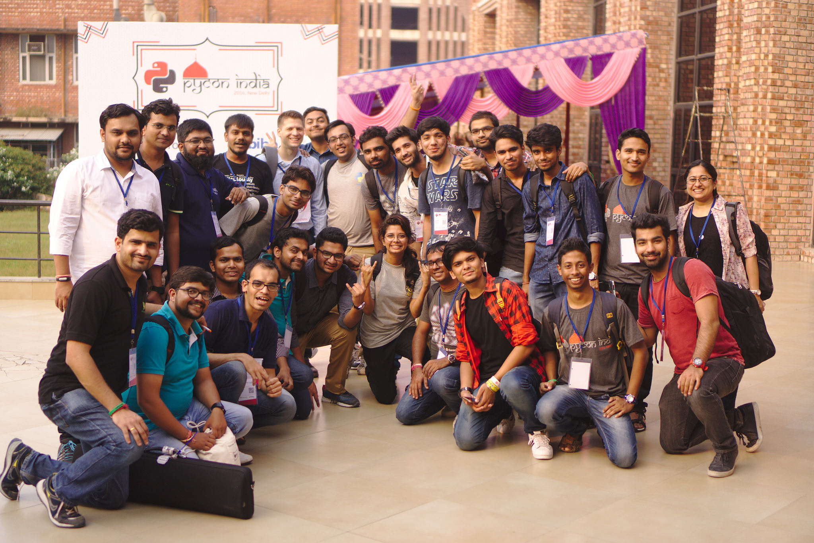
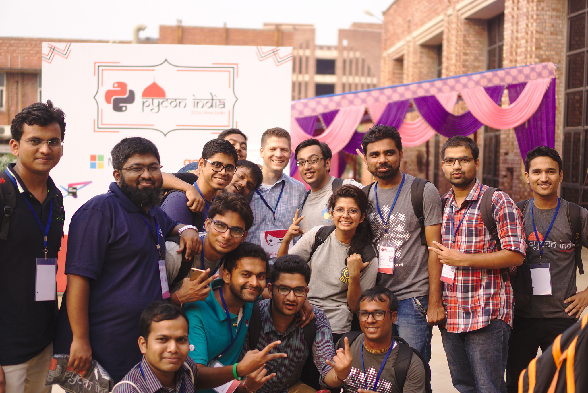

Volunteering for PyCon India 2016
#################################
:date: 2016-10-03 12:27
:author: Sanyam Khurana
:category: FOSS
:slug: pycon-india-2016
:tags: pycon, pyconindia, python

Going back in time; October 3, 2015 in Bangalore; Last day of PyCon India 2015; someone told -- "It takes 9 months to organize PyCon India"

At that time, 9 months looked like a lot of time to me and I thought may be 4-5 months should be good enough.

Coming back; 2016 -- PyCon India was organized in Delhi. And boy; behind the scenes these 3 day event took so much time -- so much preperations. I remember working on various stuff with other volunteers in PyDelhi meet-ups; sometimes hangout calls with other volunteers late night. And certainly realized that organizing an event such as PyCon India is not a child's play.

This PyCon India helped me in learning organizational skills. Organizing an event such as PyCon India, takes so much effort from people having diversified skill set. From venue to food tasting; I was fortunate enough to see it all. So, let's get into the journey of this 3 day event!

Day 0 -- PyCon India Workshop / Tutorials
-----------------------------------------

Officially, PyCon India begins! I reached the venue at 7 AM and found Akkshay telling volunteers what to do. We had a look at all the arrangements including DevSprints hall, food, room for Open Spaces and kids Zone.

There were workshops going on parallelly in 3 different tracks. Also there were bunch of folks learning to contribute in Open Source in PyCon India DevSprints. I was in the DevSprints for most of the time; (sometimes running from one audi to another check the status of the talks and helping with various stuff; as much as I could do).

In afternoon, we started preparing swag kits for PyCon India attendees & it was quite fun.

In the evening, we had a Volunteers meet to discuss -- 'What went wrong?', 'How could we correct that for the other two days?', etc. Session Chairs were assigned for each hall and volunteers were explained about their respective work.

Day 1 -- Conference Day 1
-------------------------

I reached JNU at 7 AM. I started preparing up to do a live social media feed of all the happening in PyCon India. At around 8 AM, the registrations began. Me and Hans started clicking pictures and posting them on the Social Media. Here is a picture of me trying to do a live social media feed:

Most of the day went running across the venue & helping with anything & everything. We also had a discussion on Python Express -- how to reach more audience and spread the love of Open Source and Python. Here is a picture of me while recording the MoM for the same.

.. image:: images/pycon-india-2016-2.jpg
    :align: center
    :alt: Sanyam making MoM for Python Express discussion

In the evening we went for Volunteers dinner and had a lot of fun!

Day 2 -- Conference Day 2
-------------------------

Officially the last day of PyCon India 2016; I could already sense the sadness of friends parting apart for another year. I reached the venue at 7:00 PM and today we missed the first keynote. Amit, Sahil and me went to Akshay's home to pick up the PyCon India t-shirts. Till the time we returned, the keynote was already over.

At around 11:30 we had the DGPLUG stair case meet :) We met Sirtaj, Kushal's mentor and learned about Kushal's journey in Open Source world. Here is a photo of same:

.. image:: images/pycon-india-2016-6.jpg
    :align: center
    :alt: DGPLUG stair case meet

In the afternoon, after lunch we started distributing t-shirts. Here are the awesome Pythonistas waiting to grab PyCon India t-shirt. In less than 2 hours we were able to distribute t-shirts to everyone.

.. image:: images/pycon-india-2016-5.jpg
    :align: center
    :alt: People waiting eagerly to grab awesome PyCon India 2016 t-shirt

In the evening we had discussion about "What things went wrong and how can we improve further?". Then different communities were welcomed to pitch to conduct PyCon India 2017 in their city. Since no one came forward, PyDelhi took the initiative to conduct PyCon India next year here in Delhi.

In the end I tried to meet every friend and bid adios to them until next year :) It was quite fun and I learned a lot about organizational skills. Here are some photos which marked the last moment of PyCon India 2016!

.. image:: images/pycon-india-2016-7.jpg
    :align: center
    :alt: Another one with DGPLUG folks

This event would not have been possible without the support of the community. So, I want to thank all the volunteers who came forward & helped in organizing PyCon India and making it so big. See you all next year in Delhi for PyCon India 2017 and let us make it even more big. Here is an awesome picture with everyone!

.. image:: images/pycon-india-2016-8.jpg
    :align: center
    :alt: Another one with VanL

With this thought, `CuriousLearner` signs off :)

PS: I realized so many people knew me by my nick -- and I didn't know them :(

PPS: Thanks to Kushal and Sayan for the pictures.
